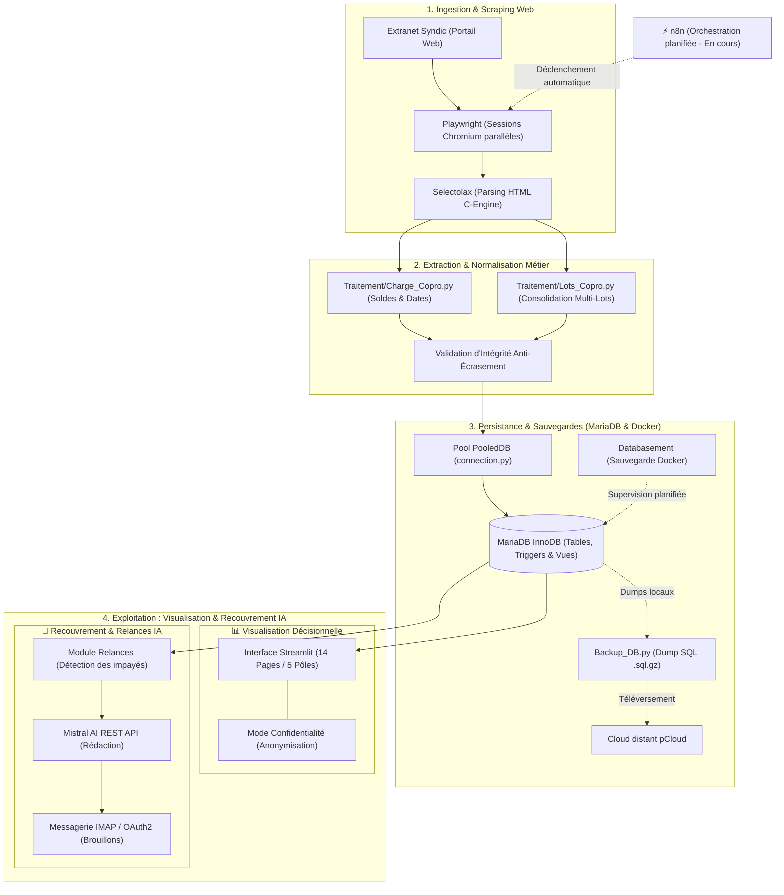

# CPTCOPRO — Suivi Intelligent & Gestion Financière de Copropriété

<div align="center">


-EA4B71?logo=n8n&logoColor=white)


**Plateforme automatisée de suivi des charges, d'audit financier, de détection d'impayés et de recouvrement assisté par IA pour copropriétés.**

[Fonctionnalités](#-possibilités-et-fonctionnalités-clés) • [Architecture](#-architecture-technique) • [Stack Technique](#-stack-technique) • [Infrastructure Docker](#-infrastructure--déploiement-docker) • [Workflow n8n](#-workflow-100-automatisé-avec-n8n-en-cours) • [Installation](#-installation--démarrage-rapide) • [Utilisation CLI](#-utilisation--options-cli) • [Propositions d'Évolution](#-propositions-daméliorations)

</div>

---

## 📖 Présentation du Projet

**CPTCOPRO** est une solution complète conçue pour simplifier le suivi comptable, auditer les charges des copropriétaires et optimiser le recouvrement des impayés au sein d'une copropriété.

L'application automatise l'intégralité du cycle de traitement des données :
1. **Extraction automatique** des données financières et parcellaires depuis l'extranet du syndic (sans saisie manuelle).
2. **Consolidation et historisation** dans une base relationnelle **MariaDB** hautement optimisée.
3. **Surveillance et alertes temps réel** sur les débits anormaux via des seuils configurables par typologie de lot.
4. **Assistance au recouvrement par Intelligence Artificielle (Mistral AI)**, générant des relances adaptées et déposant directement les courriers en brouillon dans la boîte de messagerie du gestionnaire.
5. **Visualisation décisionnelle** via un tableau de bord web interactif **Streamlit** structuré en 5 pôles métier (14 pages).
6. **Orchestration automatisée continue** via **n8n** *(en cours de développement)* pour exécuter ces flux sans intervention humaine.

---

## ✨ Possibilités et Fonctionnalités Clés

### 🔄 Ingestion & Extraction Web Automatisée
- **Scraping parallèle asynchrone** : Récupération simultanée des charges financières et de la structure des lots via des sessions Chromium isolées (**Playwright**).
- **Parsing ultra-rapide** : Moteur d'extraction haute performance basé sur **Selectolax** (moteur C Modest), bien plus rapide que BeautifulSoup.
- **Consolidation intelligente** : Rapprochement automatique des comptes, fusion des lots multiples (appartements, caves, parkings) et normalisation des dates de situation comptable.

### 🗄️ Persistance Relationnelle & Résilience (MariaDB)
- **Base de données MariaDB** : Architecture relationnelle robuste sous moteur InnoDB.
- **Pool de connexions managé** : Utilisation de `DBUtils.PooledDB` avec reconnexion transparente (`ping=1`) pour éliminer les déconnexions inactives.
- **Transactions & Résilience** : Gestion automatique des transactions avec retry exponentiel en cas de deadlock (Error 1213).
- **Triggers d'alerte en base** : Détection immédiate et purge automatique des anomalies financières directement au niveau du moteur SQL lors des écritures (`AFTER INSERT / UPDATE / DELETE`).
- **Idempotence totale** : Synchronisations exécutées via `INSERT ... ON DUPLICATE KEY UPDATE` garantissant l'absence de doublons.

### 🛡️ Sauvegarde & Continuité d'Activité (Multi-Niveaux)
- **Databasement (Docker)** : Interface web dédiée et conteneurisée pour planifier des sauvegardes automatiques, gérer la rétention (rotation) et surveiller la santé des backups MariaDB.
- **Dump logique applicatif Python pur** : Génération d'archives SQL compressées (`.sql.gz`) sans dépendance envers l'outil système `mariadb-dump`.
- **Synchronisation Cloud distante (pCloud)** : Téléversement chiffré des archives sur pCloud et **auto-restauration intelligente** : si la base MariaDB est vierge au démarrage, le système télécharge et restaure automatiquement le dernier snapshot disponible.

### 🚨 Centre d'Alertes Financières & Détection d'Anomalies
- **Seuils dynamiques configurables** : Définition des seuils de débit par type de bien (T1, T2, T3, T4, T5, etc.) ou seuil global de repli.
- **Historisation des incidents** : Suivi temporel précis de chaque anomalie (`first_detection`, `last_detection`, nombre d'occurrences).
- **Agrégats financiers en une passe** : Synthèses par typologie et consolidation globale calculées via `GROUP BY ... WITH ROLLUP`.

### 🤖 Relances Intelligentes Assistées par IA (Mistral AI)
- **Détection des échéances** : Identification automatique des copropriétaires débiteurs arrivés au terme du cycle de relance configuré (ex. 14 jours).
- **Génération contextuelle par LLM** : Rédaction personnalisée d'emails de rappel via l'API **Mistral AI** (`mistral-small-latest`) adaptant le ton (courtois, ferme, mise en demeure) selon l'historique et la gravité du débit.
- **Templates sur-mesure** : Prise en charge de modèles statiques à variables dynamiques ou de directives guidées par IA.
- **Validation humaine & Brouillons** : Visualisation, édition manuelle et validation des brouillons avant tout envoi.

### 📬 Synchronisation Messagerie (IMAP & Microsoft OAuth2)
- **Intégration transparente** : Dépôt direct des brouillons générés dans le dossier *Drafts* de la boîte mail du gestionnaire / conseil syndical.
- **Authentification moderne Microsoft** : Support complet du protocole **Microsoft OAuth2 Device Flow** (Hotmail / Outlook / Microsoft 365) et IMAP SSL standard.

### 📊 Interface Décisionnelle Streamlit (14 Pages - 5 Pôles)
L'interface utilisateur interactive offre une ergonomie moderne divisée en 5 espaces de travail :
1. **📊 1. Vue d'ensemble** : Dashboard analytique complet, indicateurs clés (KPI), solde global, alertes actives et métriques de trésorerie.
2. **💳 2. Charges & Débits** : Consultation granulaire des écritures comptables, filtres avancés et courbes d'évolution temporelle interactives (**Plotly**).
3. **👥 3. Copropriétaires** : Annuaire complet, recherche transversale 360° (par nom, lot ou code) et détail du patrimoine de chaque copropriétaire.
4. **🚨 4. Centre d'Alertes** : Surveillance des alertes en cours, statistiques d'évolution, historique et console d'ajustement des seuils en direct.
5. **✉️ 5. Relances & Messagerie** : Centre de déclenchement des relances, gestionnaire des brouillons, éditeur de modèles IA, configuration des destinataires et audit d'administration.
- **🕶️ Mode Confidentialité (Privacy Mode)** : Bouton d'anonymisation dynamique permettant de masquer instantanément les noms et données personnelles à l'écran (idéal pour les assemblées générales ou captures d'écran).

---

## 🏗️ Architecture Technique

L'application repose sur une architecture modulaire en couches garantissant une stricte séparation des responsabilités, avec un flux unidirectionnel du scraping jusqu'à l'exploitation :



---

## 💻 Stack Technique

| Domaine | Technologies | Rôle & Justification |
| :--- | :--- | :--- |
| **Langage** | **Python 3.12+** | Langage de référence, typage strict (`mypy strict`), asynchronisme. |
| **Frontend & Dataviz** | **Streamlit**, **Plotly Express**, **st-styled** | Interface web réactive, graphiques financiers interactifs, thématisation soignée. |
| **Base de Données** | **MariaDB 11+**, **PyMySQL**, **DBUtils** | Moteur relationnel InnoDB, transactions ACID, pool de connexions haute performance `PooledDB`. |
| **Conteneurisation** | **Docker**, **Docker Compose** | Déploiement standardisé, isolation de MariaDB, Databasement et n8n. |
| **Sauvegarde BDD** | **Databasement**, **pCloud SDK**, **gzip** | Stratégie hybride : monitoring web des sauvegardes (Databasement) + dumps applicatifs `.sql.gz` + stockage pCloud. |
| **Orchestration** | **n8n** *(En cours)* | Workflow automation 100% autonome, scénarios d'exécution planifiés, webhooks d'alertes. |
| **Scraping & Parsing** | **Playwright**, **Selectolax** | Automatisation de navigateur headless parallèle et parsing HTML ultra-rapide. |
| **Intelligence Artificielle** | **Mistral AI API** (`mistral-small-latest`) | Génération contextuelle des relances avec ajustement de ton et respect du contexte débiteur. |
| **Messagerie & Auth** | **IMAP (SSL)**, **MSAL** (Microsoft Authentication Library) | Dépôt automatique de courriers en brouillon avec support du flux OAuth2 Device Flow. |
| **Qualité & Sécurité** | **Pytest**, **Ruff**, **Mypy**, **Bandit**, **Pip-audit** | Suite de tests exhaustive, linting/formatting moderne, analyse statique de sécurité. |
| **Logging & Console** | **Loguru**, **Rich** | Rotation et compression automatique des logs, affichage terminal coloré et structuré. |

---

## ⚡ Workflow 100% Automatisé avec n8n *(En cours)*

Un workflow d'automatisation est en cours d'élaboration sur **n8n** afin de piloter et d'orchestrer l'ensemble des processus de manière autonome :

- ⏰ **Exécution périodique autonome** : Planification programmée des déclenchements (cron) sans action manuelle.
- 🔗 **Orchestration des services** : Coordination entre la collecte des données, la mise à jour MariaDB, les sauvegardes et les relances.
- 🔔 **Alertes & Notifications instantanées** : Notification par webhook (Discord, Telegram, Slack ou Email) pour le suivi des exécutions, les alertes d'impayés et l'état des sauvegardes.
- 🛡️ **Tolérance aux pannes** : Gestion automatisée des réessais et surveillance de la disponibilité des services.

---

## 🐳 Infrastructure & Déploiement Docker

Pour assurer la persistance des données, la supervision des sauvegardes et l'orchestration des flux, la stack **Docker Compose** suivante réunit **MariaDB**, **Databasement** et **n8n**.

### Fichier `docker-compose.yml`

```yaml
services:
  # 1. Base de données relationnelle
  mariadb:
    image: mariadb:11.4
    container_name: cptcopro-mariadb
    restart: unless-stopped
    environment:
      MARIADB_ROOT_PASSWORD: secret_root_password
      MARIADB_DATABASE: coproprietaires
      MARIADB_USER: cptcopro_user
      MARIADB_PASSWORD: secret_user_password
    ports:
      - "3306:3306"
    volumes:
      - mariadb_data:/var/lib/mysql
    networks:
      - cptcopro-network

  # 2. Gestionnaire web de sauvegardes de bases de données
  databasement:
    image: databasement/databasement:latest
    container_name: cptcopro-databasement
    restart: unless-stopped
    ports:
      - "8080:8080"
    environment:
      - PORT=8080
    volumes:
      - databasement_data:/app/data
      - ./backups:/backups
    depends_on:
      - mariadb
    networks:
      - cptcopro-network

  # 3. Moteur d'automatisation et d'orchestration (Workflow 100% automatisé)
  n8n:
    image: docker.n8n.io/n8nio/n8n:latest
    container_name: cptcopro-n8n
    restart: unless-stopped
    ports:
      - "5678:5678"
    environment:
      - N8N_HOST=localhost
      - N8N_PORT=5678
      - N8N_PROTOCOL=http
      - NODE_ENV=production
      - WEBHOOK_URL=http://localhost:5678/
      - GENERIC_TIMEZONE=Europe/Paris
    volumes:
      - n8n_data:/home/node/.n8n
    depends_on:
      - mariadb
    networks:
      - cptcopro-network

volumes:
  mariadb_data:
  databasement_data:
  n8n_data:

networks:
  cptcopro-network:
    driver: bridge
```

> [!TIP]
> **Complémentarité Databasement & pCloud**
> Databasement assure la gestion de la politique de rétention locale (sauvegardes horaires, quotidiennes et hebdomadaires avec restauration en un clic via interface web), tandis que le script Python intégré téléverse automatiquement une copie chiffrée sur pCloud pour la redondance hors-site.

---

## 🚀 Installation & Démarrage Rapide

### Prérequis
- **Python 3.12+**
- **Poetry** (recommandé) ou **pip**
- Une instance **MariaDB** active (locale ou via le conteneur Docker ci-dessus)

### 1. Cloner le projet et installer les dépendances

```powershell
# Cloner le dépôt
git clone https://github.com/therealcorwin/CPTCOPRO.git
cd CPTCOPRO

# Installer l'environnement avec Poetry
poetry install

# Installer les navigateurs Playwright
poetry run playwright install chromium
```

### 2. Configuration (`.env`)

Créez un fichier `.env` à la racine du projet :

```env
# ==============================================================================
# 1. EXTRANET DU SYNDIC
# ==============================================================================
login_site_copro=votre_identifiant_syndic
password_site_copro=votre_mot_de_passe_syndic
url_site_copro=https://extranet-du-syndic.com
url_situation_copro=https://extranet-du-syndic.com/situation

# ==============================================================================
# 2. BASE DE DONNÉES MARIADB
# ==============================================================================
MARIADB_HOST=127.0.0.1
MARIADB_PORT=3306
MARIADB_USER=cptcopro_user
MARIADB_PASSWORD=secret_user_password
MARIADB_DATABASE=coproprietaires

# ==============================================================================
# 3. SAUVEGARDE CLOUD PCLOUD
# ==============================================================================
pcloud_APP_KEY=votre_app_key_pcloud
pcloud_APP_SECRET=votre_app_secret_pcloud
pcloud_location_id=1
pcloud_backup_folder=CPTCOPRO_Backups
pcloud_backup_folder_id=votre_dossier_id
pcloud_backup_file=coproprietaires_backup.sql.gz

# ==============================================================================
# 4. MODULE DE RELANCES (OPTIONNEL - IA MISTRAL & MESSAGERIE)
# ==============================================================================
MISTRAL_API_KEY=votre_cle_api_mistral
RELANCE_MAILBOX_PASSWORD=mot_de_passe_ou_app_password
# Ou pour Microsoft OAuth2 Device Flow :
MS_CLIENT_ID=votre_client_id_azure_ad
```

> [!NOTE]
> La création des tables, l'application des triggers d'alerte et la vue analytique sont prises en charge automatiquement par l'application lors de son premier lancement.
> 
> **Prérequis indispensable** : assurez-vous que la stack Docker MariaDB soit bien démarrée et opérationnelle avant d'exécuter l'application (voir la section [Infrastructure & Déploiement Docker](#-infrastructure--déploiement-docker)).

---

## 🖥️ Utilisation & Options CLI

### Lancement standard (Extraction complète + Interface Streamlit)

```powershell
poetry run python src/cptcopro/main.py
```

### Lancement direct de l'interface Streamlit seule (sans extraction)

```powershell
poetry run streamlit run src/cptcopro/Affichage_Stream.py
```

### Options de ligne de commande (`src/cptcopro/main.py`)

```powershell
# --- Navigation & Scraping ---
poetry run python src/cptcopro/main.py --no-headless          # Affiche le navigateur Playwright (mode debug)

# --- Affichage & Interface ---
poetry run python src/cptcopro/main.py --no-serve             # Exécute l'extraction et l'écriture BDD sans lancer Streamlit
poetry run python src/cptcopro/main.py --show-console         # Affiche les données consolidées dans la console avec Rich
poetry run python src/cptcopro/main.py --serve-port 8502      # Change le port du serveur Streamlit (défaut : 8501)
poetry run python src/cptcopro/main.py --streamlit-no-browser # Démarre Streamlit sans ouvrir automatiquement le navigateur

# --- Sauvegardes & pCloud ---
poetry run python src/cptcopro/main.py --no-backup             # Désactive le téléversement de la sauvegarde sur pCloud
poetry run python src/cptcopro/main.py --deco-pcloud           # Déconnecte la session pCloud et purge le jeton local

# --- Relances & Automatisation ---
poetry run python src/cptcopro/main.py --auto-relance-drafts  # Génère automatiquement les brouillons pour les débiteurs
poetry run python src/cptcopro/main.py --auto-relance-drafts --relance-imap # Dépose aussi les brouillons directement dans la messagerie IMAP
```

---

## 🧪 Qualité du Code & Tests

Le projet applique des normes de rigueur élevées pour assurer la fiabilité des calculs financiers et la stabilité des flux :

```powershell
# Exécuter l'ensemble des tests unitaires et d'intégration
poetry run pytest

# Générer le rapport de couverture de tests
poetry run pytest --cov=cptcopro --cov-report=html

# Linting et formatage avec Ruff
poetry run ruff check .
poetry run ruff format .

# Analyse statique des types avec Mypy (mode strict)
poetry run mypy src/cptcopro

# Audit de sécurité des vulnérabilités (Bandit)
poetry run bandit -r src/cptcopro
```

---

## 💡 Propositions d'Améliorations & Roadmap

Voici quelques pistes d'évolutions à forte valeur ajoutée pour poursuivre le développement du projet :

- [ ] **⚡ Finalisation du Workflow n8n** : Déploiement complet de l'orchestration et des scénarios automatisés de bout en bout.
- [ ] **📦 Conteneurisation Globale de CPTCOPRO** : Créer un `Dockerfile` pour l'application afin d'intégrer CPTCOPRO directement dans le `docker-compose.yml` aux côtés de MariaDB, Databasement et n8n.
- [ ] **🔔 Notifications Multi-Canaux en Production** : Alertes instantanées sur smartphone via Telegram ou Discord dès qu'une anomalie critique ou un dépassement de seuil est détecté.
- [ ] **📄 Export PDF & Rapports d'Audit Comptable** : Module d'export PDF stylisé pour éditer des fiches de situation individuelles ou des bilans annuels de charges à destination de l'Assemblée Générale.
- [ ] **🤖 Support Multi-LLM** : Choix configurable du modèle de langage pour la rédaction des relances (Mistral AI, OpenAI GPT-4o, Anthropic Claude, ou modèle local Ollama).
- [ ] **🚀 Pipeline CI/CD GitHub Actions** : Automatisation de la suite de tests, du linting Ruff/Mypy et du build des images à chaque push.

---

## 👥 Auteur & Licence

- **Auteur** : [Therealcorwin](https://github.com/therealcorwin)
- **Projet** : CPTCOPRO — Suivi Compte Copro
- **Documentation technique détaillée** : Consultez [`reports/call_graph.md`](reports/call_graph.md) pour le graphe d'appels complet et les spécifications d'ingénierie.
