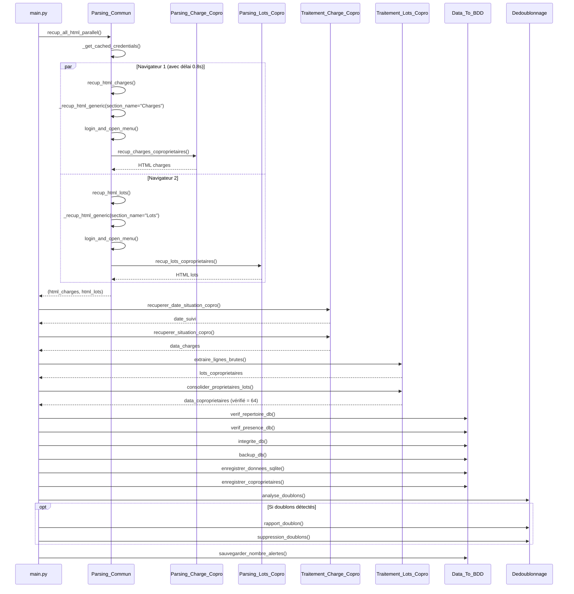
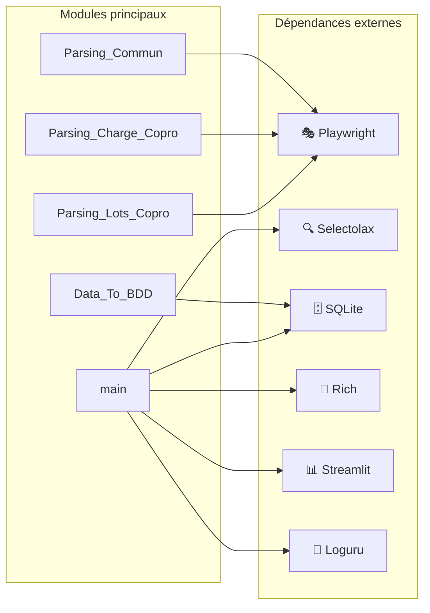
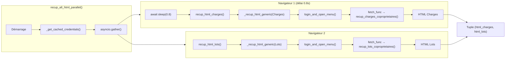

# Graphe des appels de fonctions - CPTCOPRO

## Vue d'ensemble de l'architecture

```mermaid
flowchart TB
    subgraph MAIN["🚀 main.py"]
        main["main()"]
    end

    subgraph PARSING_COMMUN["🔗 Parsing_Commun.py"]
        recup_all_html_parallel["recup_all_html_parallel()"]
        recup_html_generic["_recup_html_generic()"]
        recup_html_charges["recup_html_charges()"]
        recup_html_lots["recup_html_lots()"]
        login_and_open_menu["login_and_open_menu()"]
        get_cached_credentials["_get_cached_credentials()"]
    end

    subgraph PARSING_CHARGE["📊 Parsing_Charge_Copro.py"]
        recup_charges_coproprietaires["recup_charges_coproprietaires()"]
    end

    subgraph PARSING_LOTS["🏠 Parsing_Lots_Copro.py"]
        recup_lots_coproprietaires["recup_lots_coproprietaires()"]
    end

    subgraph TRAITEMENT_CHARGE["⚙️ Traitement_Charge_Copro.py"]
        recuperer_date["recuperer_date_situation_copro()"]
        recuperer_situation["recuperer_situation_copro()"]
        afficher_etat["afficher_etat_coproprietaire()"]
    end

    subgraph TRAITEMENT_LOTS["⚙️ Traitement_Lots_Copro.py"]
        extraire_lignes["extraire_lignes_brutes()"]
        consolider["consolider_proprietaires_lots()"]
        afficher_rich["afficher_avec_rich()"]
    end

    subgraph DATA_BDD["💾 Data_To_BDD.py"]
        verif_repertoire["verif_repertoire_db()"]
        verif_presence["verif_presence_db()"]
        integrite_db["integrite_db()"]
        enregistrer_charges["enregistrer_donnees_sqlite()"]
        enregistrer_copro["enregistrer_coproprietaires()"]
        sauv_alertes["sauvegarder_nombre_alertes()"]
    end

    subgraph BACKUP["💿 Backup_DB.py"]
        backup_db["backup_db()"]
    end

    subgraph DEDOUBLONNAGE["🔍 Dedoublonnage.py"]
        analyse_doublons["analyse_doublons()"]
        rapport_doublon["rapport_doublon()"]
        suppression_doublons["suppression_doublons()"]
    end

    subgraph UTILS["🛠️ Utils"]
        env_loader["get_credentials()"]
        browser_launcher["launch_browser()"]
        streamlit_launcher["start_streamlit()"]
    end

    %% Flux principal
    main --> recup_all_html_parallel
    
    %% Parsing parallèle
    recup_all_html_parallel --> get_cached_credentials
    recup_all_html_parallel --> recup_html_charges
    recup_all_html_parallel --> recup_html_lots
    
    %% Fonction générique (DRY)
    recup_html_charges --> recup_html_generic
    recup_html_lots --> recup_html_generic
    
    recup_html_generic --> browser_launcher
    recup_html_generic --> login_and_open_menu
    recup_html_generic -.->|"fetch_func"| recup_charges_coproprietaires
    recup_html_generic -.->|"fetch_func"| recup_lots_coproprietaires
    
    get_cached_credentials --> env_loader
    
    %% Traitement des données
    main --> recuperer_date
    main --> recuperer_situation
    main --> extraire_lignes
    main --> consolider
    main --> afficher_etat
    main --> afficher_rich
    
    %% Base de données (appels séquentiels simples)
    main --> verif_repertoire
    main --> verif_presence
    main --> integrite_db
    main --> backup_db
    main --> enregistrer_charges
    main --> enregistrer_copro
    
    %% Déduplication
    main --> analyse_doublons
    main --> rapport_doublon
    main --> suppression_doublons
    
    %% Alertes
    main --> sauv_alertes
    
    %% Streamlit
    main --> streamlit_launcher
```



## Flux d'exécution détaillé



## Structure des modules

| Module | Responsabilité | Fonctions principales |
|--------|----------------|----------------------|
| `main.py` | Orchestration principale, CLI | `main()` |
| `Parsing_Commun.py` | Connexion, authentification, orchestration parallèle | `recup_all_html_parallel()`, `_recup_html_generic()`, `login_and_open_menu()` |
| `Parsing_Charge_Copro.py` | Navigation spécifique pour les charges | `recup_charges_coproprietaires()` |
| `Parsing_Lots_Copro.py` | Navigation spécifique pour les lots | `recup_lots_coproprietaires()` |
| `Traitement_Charge_Copro.py` | Parsing HTML des charges | `recuperer_date_situation_copro()`, `recuperer_situation_copro()` |
| `Traitement_Lots_Copro.py` | Parsing HTML des lots | `extraire_lignes_brutes()`, `consolider_proprietaires_lots()` |
| `Data_To_BDD.py` | Opérations SQLite | `enregistrer_donnees_sqlite()`, `enregistrer_coproprietaires()`, `integrite_db()` |
| `Backup_DB.py` | Sauvegarde de la base | `backup_db()` |
| `Dedoublonnage.py` | Détection/suppression doublons | `analyse_doublons()`, `suppression_doublons()`, `rapport_doublon()` |

## Gestion des connexions SQLite

```mermaid
flowchart TB
    subgraph Architecture["✅ Architecture simple (try/finally)"]
        direction TB
        
        subgraph Func1["enregistrer_donnees_sqlite()"]
            conn1["conn = sqlite3.connect(db_path)"]
            try1["try: cursor.executemany(...)"]
            finally1["finally: conn.close()"]
            conn1 --> try1 --> finally1
        end
        
        subgraph Func2["enregistrer_coproprietaires()"]
            conn2["conn = sqlite3.connect(db_path)"]
            try2["try: cursor.executemany(...)"]
            finally2["finally: conn.close()"]
            conn2 --> try2 --> finally2
        end
        
        subgraph Func3["analyse_doublons()"]
            conn3["conn = sqlite3.connect(db_path)"]
            try3["try: cursor.execute(...)"]
            finally3["finally: conn.close()"]
            conn3 --> try3 --> finally3
        end
    end
```



### Pattern simple (sans context manager)

Chaque fonction gère sa propre connexion avec `try/finally` :

```python
def enregistrer_donnees_sqlite(data: list, db_path: str) -> None:
    """Enregistre les données des charges dans la base SQLite."""
    conn = sqlite3.connect(db_path)
    try:
        cursor = conn.cursor()
        cursor.executemany(
            "INSERT INTO charge (...) VALUES (...)",
            data[3:]
        )
        conn.commit()
        logger.success(f"{len(data[3:])} enregistrements insérés")
    finally:
        conn.close()
```

## Dépendances externes



## Détail du flux parallèle



## Refactorisation _recup_html_generic (DRY)

La fonction `_recup_html_generic` centralise la logique commune de browser/login/navigation :

```python
async def _recup_html_generic(
    headless: bool,
    login: str,
    password: str,
    url: str,
    section_name: str,  # "Charges" ou "Lots"
    fetch_func,         # Fonction de navigation spécifique
) -> str:
    """Fonction générique pour récupérer le HTML d'une section."""
    async with async_playwright() as p:
        browser = await launch_browser(p, headless=headless)
        if browser is None:
            return "KO_OPEN_BROWSER"
        
        page = await browser.new_page()
        error = await login_and_open_menu(page, login, password, url)
        if error:
            await browser.close()
            return error
        
        html = await fetch_func(page)  # Appel de la fonction spécifique
        await browser.close()
        return html
```

Les fonctions publiques deviennent de simples wrappers :

```python
async def recup_html_charges(...) -> str:
    return await _recup_html_generic(
        ..., section_name="Charges",
        fetch_func=pcc.recup_charges_coproprietaires
    )

async def recup_html_lots(...) -> str:
    return await _recup_html_generic(
        ..., section_name="Lots",
        fetch_func=pcl.recup_lots_coproprietaires
    )
```

## Avantages du parsing parallèle

| Aspect | Séquentiel (avant) | Parallèle (maintenant) |
|--------|-------------------|----------------------|
| **Navigateurs** | 1 (réutilisé) | 2 (indépendants) |
| **Sessions** | Partagée | Isolées |
| **Temps** | ~T1 + T2 | ~max(T1, T2) |
| **Risques** | Conflits de cookies | Aucun |
| **Délai entre logins** | N/A | 800ms (évite blocage serveur) |

## Notes techniques

- **Parsing parallèle** : 2 navigateurs Playwright indépendants avec délai de 800ms
- **Refactorisation DRY** : `_recup_html_generic()` centralise la logique browser/login/navigation
- **Timeouts explicites** : `wait_for_selector` avec timeout de 10s avant les clics critiques
- **Validation** : Vérification que 64 copropriétaires sont consolidés
- **SQLite** : Chaque fonction gère sa propre connexion (simple et robuste)
- **Codes d'erreur** : Les fonctions de parsing retournent des codes `KO_*` en cas d'échec (générés dynamiquement via `section_name`)
