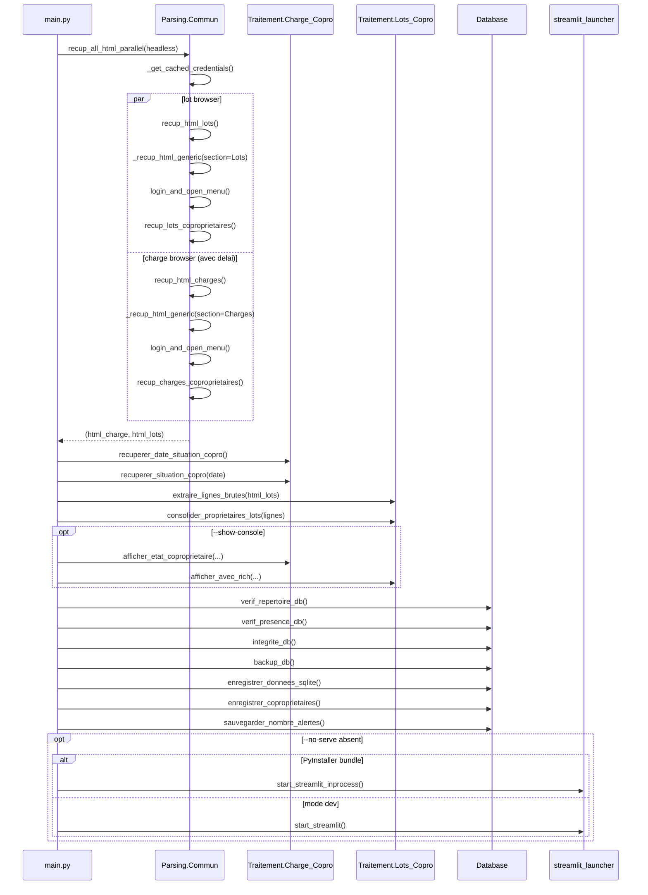
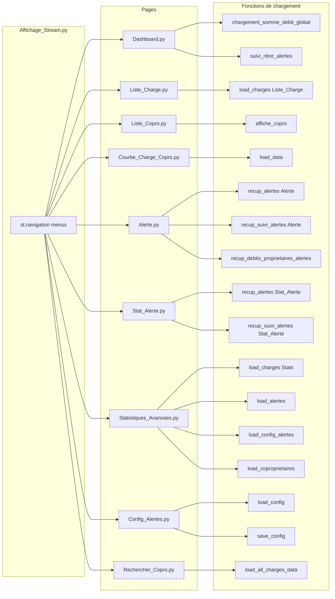

# Graphe des appels de fonctions - CPTCOPRO

## Objectif

Ce document decrit les appels de fonctions reels du projet et sert de reference de maintenance.
Il est aligne sur le code actuel de l'application.
Pour une vue plus compacte du depot, voir README.md et .github/copilot-instructions.md.

## Vue d'ensemble (runtime)

```mermaid
flowchart TB
    subgraph ENTRY[Point d'entree]
        main[main.py main()]
    end

    subgraph PARSING[Parsing]
        p_all[recup_all_html_parallel]
        p_get[_get_cached_credentials]
        p_hc[recup_html_charges]
        p_hl[recup_html_lots]
        p_gen[_recup_html_generic]
        p_login[login_and_open_menu]
        p_c[recup_charges_coproprietaires]
        p_l[recup_lots_coproprietaires]
    end

    subgraph TRAITEMENT[Traitement]
        t_date[recuperer_date_situation_copro]
        t_sit[recuperer_situation_copro]
        t_lines[extraire_lignes_brutes]
        t_cons[consolider_proprietaires_lots]
        t_show1[afficher_etat_coproprietaire]
        t_show2[afficher_avec_rich]
    end

    subgraph DB[Database]
        d_rep[verif_repertoire_db]
        d_pre[verif_presence_db]
        d_int[integrite_db]
        d_bak[backup_db]
        d_ins1[enregistrer_donnees_sqlite]
        d_ins2[enregistrer_coproprietaires]
        d_suivi[sauvegarder_nombre_alertes]
    end

    subgraph UI[Streamlit]
        ui_start[start_streamlit_inprocess / start_streamlit]
        ui_app[Affichage_Stream.py]
    end

    main --> p_all
    p_all --> p_get
    p_all --> p_hc
    p_all --> p_hl
    p_hc --> p_gen
    p_hl --> p_gen
    p_gen --> p_login
    p_gen --> p_c
    p_gen --> p_l

    main --> t_date
    main --> t_sit
    main --> t_lines
    main --> t_cons

    main -. show-console .-> t_show1
    main -. show-console .-> t_show2

    main --> d_rep
    main --> d_pre
    main --> d_int
    main --> d_bak
    main --> d_ins1
    main --> d_ins2
    main --> d_suivi

    main -. no-serve=false .-> ui_start
    ui_start --> ui_app
```

## Flux d'execution reel (main)

```mermaid
sequenceDiagram
    participant M as main.py
    participant P as Parsing.Commun
    participant TC as Traitement.Charge_Copro
    participant TL as Traitement.Lots_Copro
    participant DB as Database
    participant SL as streamlit_launcher

    M->>P: recup_all_html_parallel(headless)
    P->>P: _get_cached_credentials()

    par lot browser
        P->>P: recup_html_lots()
        P->>P: _recup_html_generic(section=Lots)
        P->>P: login_and_open_menu()
        P->>P: recup_lots_coproprietaires()
    and charge browser (avec delai)
        P->>P: recup_html_charges()
        P->>P: _recup_html_generic(section=Charges)
        P->>P: login_and_open_menu()
        P->>P: recup_charges_coproprietaires()
    end

    P-->>M: (html_charge, html_lots)

    M->>TC: recuperer_date_situation_copro()
    M->>TC: recuperer_situation_copro(date)
    M->>TL: extraire_lignes_brutes(html_lots)
    M->>TL: consolider_proprietaires_lots(lignes)

    opt --show-console
        M->>TC: afficher_etat_coproprietaire(...)
        M->>TL: afficher_avec_rich(...)
    end

    M->>DB: verif_repertoire_db()
    M->>DB: verif_presence_db()
    M->>DB: integrite_db()
    M->>DB: backup_db()
    M->>DB: enregistrer_donnees_sqlite()
    M->>DB: enregistrer_coproprietaires()
    M->>DB: sauvegarder_nombre_alertes()

    opt --no-serve absent
        alt PyInstaller bundle
            M->>SL: start_streamlit_inprocess()
        else mode dev
            M->>SL: start_streamlit()
        end
    end
```

## Cartographie Streamlit complete

```mermaid
flowchart LR
    subgraph APP[Affichage_Stream.py]
        nav[st.navigation menus]
    end

    subgraph PAGES[Pages]
        pg_dashboard[Dashboard.py]
        pg_liste_charge[Liste_Charge.py]
        pg_liste_copro[Liste_Copro.py]
        pg_courbe[Courbe_Charge_Copro.py]
        pg_alerte[Alerte.py]
        pg_stat_alerte[Stat_Alerte.py]
        pg_stats_adv[Statistiques_Avancees.py]
        pg_config[Config_Alertes.py]
        pg_search[Rechercher_Copro.py]
    end

    subgraph DATA_FUNCTIONS[Fonctions de chargement]
        f_dash1[chargement_somme_debit_global]
        f_dash2[suivi_nbre_alertes]
        f_lc[load_charges Liste_Charge]
        f_lcopro[affiche_copro]
        f_courbe[load_data]
        f_al1[recup_alertes Alerte]
        f_al2[recup_suivi_alertes Alerte]
        f_al3[recup_debits_proprietaires_alertes]
        f_sa1[recup_alertes Stat_Alerte]
        f_sa2[recup_suivi_alertes Stat_Alerte]
        f_sadv1[load_charges Stats]
        f_sadv2[load_alertes]
        f_sadv3[load_config_alertes]
        f_sadv4[load_coproprietaires]
        f_cfg1[load_config]
        f_cfg2[save_config]
        f_rech[load_all_charges_data]
    end

    nav --> pg_dashboard --> f_dash1
    pg_dashboard --> f_dash2

    nav --> pg_liste_charge --> f_lc
    nav --> pg_liste_copro --> f_lcopro
    nav --> pg_courbe --> f_courbe

    nav --> pg_alerte --> f_al1
    pg_alerte --> f_al2
    pg_alerte --> f_al3

    nav --> pg_stat_alerte --> f_sa1
    pg_stat_alerte --> f_sa2

    nav --> pg_stats_adv --> f_sadv1
    pg_stats_adv --> f_sadv2
    pg_stats_adv --> f_sadv3
    pg_stats_adv --> f_sadv4

    nav --> pg_config --> f_cfg1
    pg_config --> f_cfg2

    nav --> pg_search --> f_rech
```

## Organisation des modules (corrigee)

| Module | Responsabilite | Fonctions principales |
| --- | --- | --- |
| main.py | Orchestration, CLI, execution | main |
| Parsing/Commun.py | Orchestration parallele et login | recup_all_html_parallel, recup_html_charges, recup_html_lots, \_recup_html_generic, login_and_open_menu |
| Parsing/Charge_Copro.py | Navigation charge | recup_charges_coproprietaires |
| Parsing/Lots_Copro.py | Navigation lots | recup_lots_coproprietaires |
| Traitement/Charge_Copro.py | Parsing HTML charges | recuperer_date_situation_copro, recuperer_situation_copro, afficher_etat_coproprietaire |
| Traitement/Lots_Copro.py | Parsing HTML lots | extraire_lignes_brutes, consolider_proprietaires_lots, afficher_avec_rich |
| Database/Verif_Prerequis_BDD.py | Prerequis repertoires | verif_repertoire_db |
| Database/Creation_BDD.py | Presence DB et integrite schema | verif_presence_db, integrite_db |
| Database/Charges_To_BDD.py | Persist charges | enregistrer_donnees_sqlite |
| Database/Coproprietaires_To_BDD.py | Persist coproprietaires | enregistrer_coproprietaires |
| Database/Alertes_Config.py | Seuils et suivi alertes | get_config_alertes, update_config_alerte, get_threshold_for_type, init_config_alerte_if_missing, sauvegarder_nombre_alertes |
| Database/Backup_DB.py | Sauvegarde sqlite | backup_db |
| Database/Dedoublonnage.py | Outils dedoublonnage (hors flux principal) | analyse_doublons, rapport_doublon, suppression_doublons |
| Affichage_Stream.py | Navigation multi-pages Streamlit | st.navigation, menus.run |

## Constantes de timing (source de verite)

| Constante | Valeur | Unite | Usage |
| --- | ---: | --- | --- |
| DELAY_PARALLEL_LOGIN | 3.0 | secondes | Decalage avant login charges en mode parallele |
| DELAY_RETRY_URL | 2000 | millisecondes | Attente avant retry acces URL |
| DELAY_RETRY_MENU | 3000 | millisecondes | Attente avant retry clic menu |
| TIMEOUT_URL_ACCESS | 30000 | millisecondes | Timeout navigation URL |
| TIMEOUT_MENU_WAIT | 15000 | millisecondes | Timeout attente menu |

## Options CLI qui changent le flux

| Option | Effet sur le flux |
| --- | --- |
| --show-console | Active les affichages Rich apres parsing |
| --no-serve | Desactive le lancement Streamlit |
| --no-headless | Lance Playwright en mode visible |
| --db-path | Surcharge le chemin SQLite |
| --serve-host, --serve-port | Parametrent le lancement Streamlit |
| --streamlit-\* | Controle ouverture navigateur/console et redirection log |

## Notes importantes

- La fonction privee _recup_html_generic est le coeur DRY de la collecte HTML.
- Le flux principal n'appelle plus le dedoublonnage.
- Raison: index UNIQUE et INSERT OR REPLACE dans la persistance des charges.
- Les pages Streamlit utilisent majoritairement @st.cache_data sur les fonctions de chargement.
- README.md donne la vue d'ensemble du projet; ce document decrit le detail des flux d'appel.

## Source of truth

Verifier en priorite ces fichiers lors des evolutions:

1. src/cptcopro/main.py
2. src/cptcopro/Parsing/Commun.py
3. src/cptcopro/Parsing/constants.py
4. src/cptcopro/Affichage_Stream.py
5. src/cptcopro/Database/__init__.py
6. src/cptcopro/Pages/*.py

## Checklist avant merge

1. Toutes les fonctions citees existent-elles encore avec le meme nom?
2. Les timings documentes correspondent-ils a Parsing/constants.py?
3. Les options CLI documentees existent-elles dans main.py?
4. Une nouvelle page Streamlit a-t-elle ete ajoutee dans Affichage_Stream.py?
5. Un flux conditionnel est-il devenu obligatoire (ou inversement)?
6. Les diagrammes Mermaid se rendent-ils correctement?
