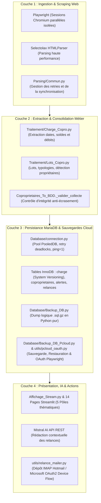
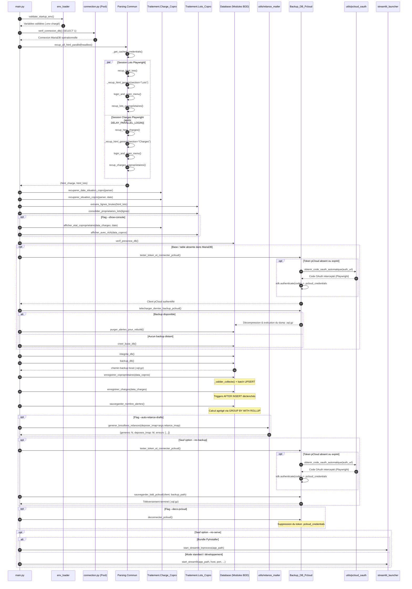
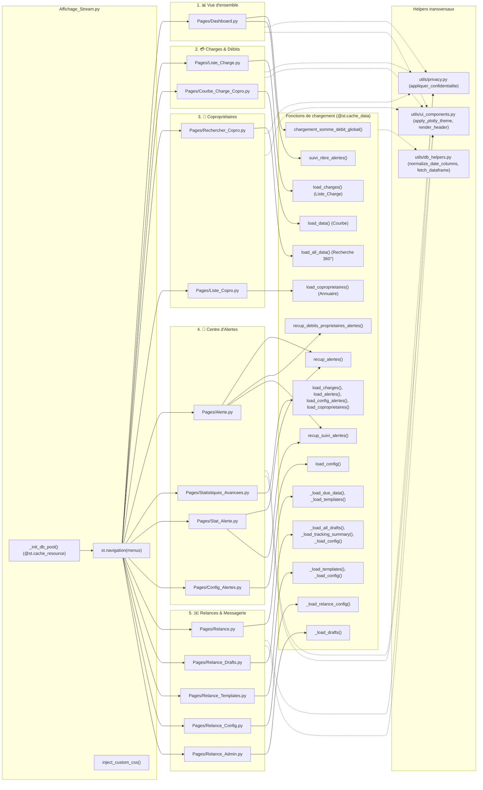
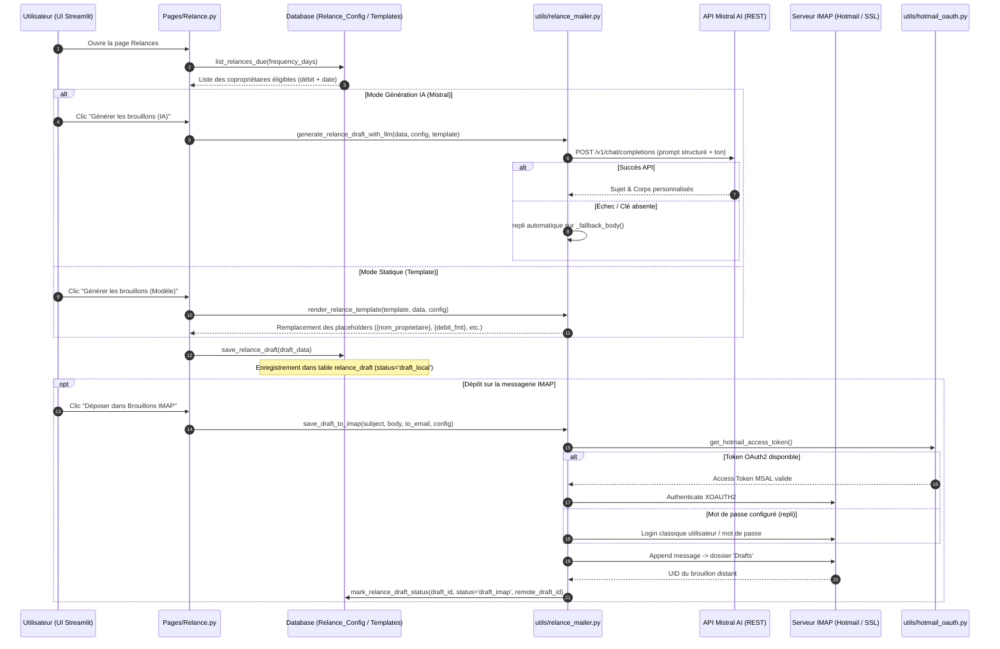
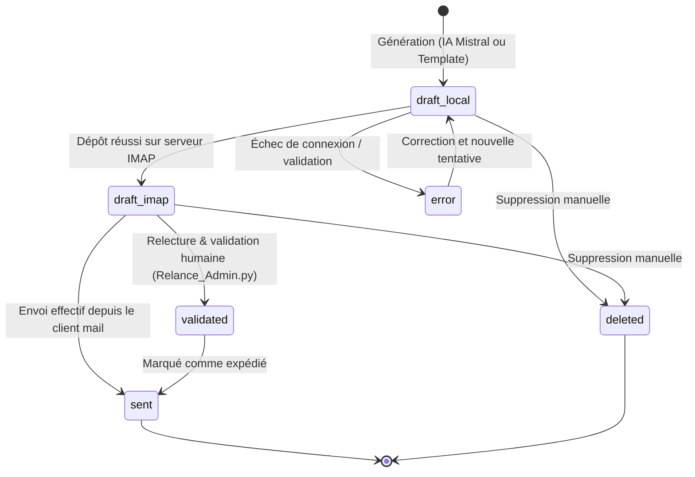
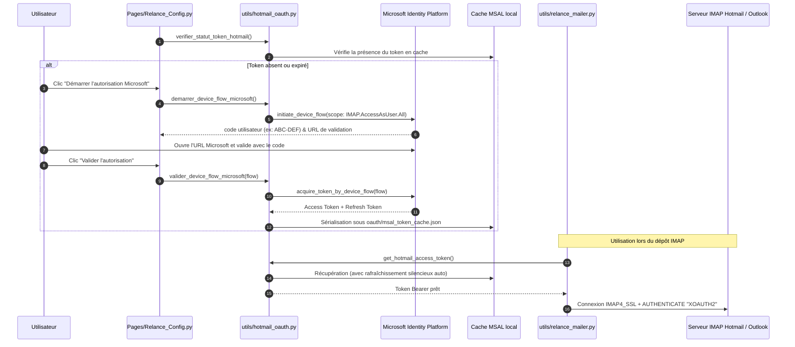
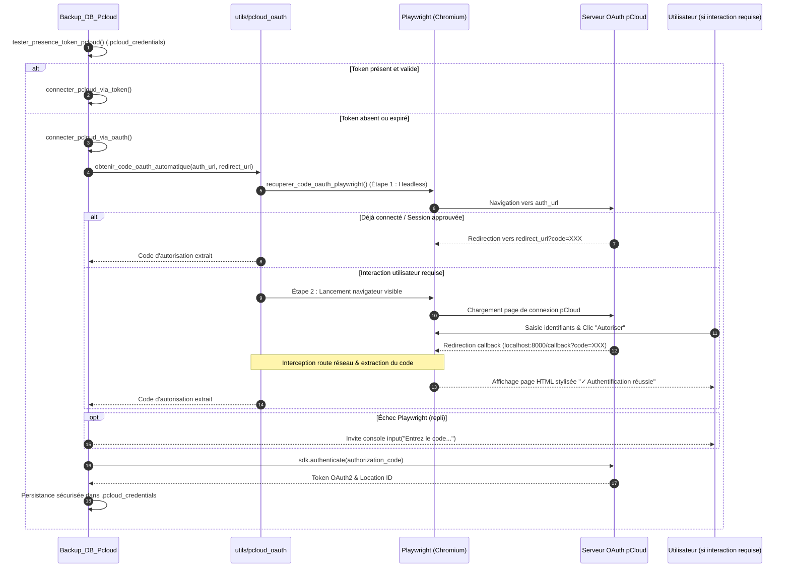

# Graphe des appels de fonctions - CPTCOPRO

## Objectif

Ce document décrit l'architecture d'appels réels de fonctions du projet CPTCOPRO et sert de référence d'ingénierie et de maintenance.
Il est strictement aligné sur le code actuel de l'application (version 2.0 - MariaDB, Streamlit multi-pages, génération assistée par IA Mistral et synchronisation IMAP/pCloud).
Il privilégie la lisibilité : un résumé rapide, un déroulé pas-à-pas, des diagrammes Mermaid de soutien, puis les matrices de référence.

Pour une vue synthétique du projet, voir `README.md` et `.github/copilot-instructions.md`.

## Comment lire ce document

1. **Vue d'ensemble (runtime)** : Cartographie macroscopique des flux d'exécution lors d'un lancement standard via CLI.
2. **Déroulé du flux principal** : Ordre chronologique concret des appels dans `main.py`.
3. **Cartographie Streamlit** : Structuration de la navigation (5 pôles), des 14 pages et de leurs fonctions de chargement `@st.cache_data`.
4. **Sous-système de Relances (IA & Messagerie)** : Pipeline de génération de messages (Mistral AI ou modèles statiques), gestion des brouillons et synchronisation IMAP Hotmail (OAuth2).
5. **Confidentialité & Sécurité** : Anonymisation des données sensibles et flux d'autorisation Microsoft OAuth2 Device Flow.
6. **Matrices de référence** : Catalogue des modules, matrice CRUD des tables MariaDB, options CLI et constantes de timing.

---

## Architecture globale en couches (Layered Architecture)

L'application CPTCOPRO est structurée selon un modèle architectural en 4 couches étanches, garantissant la séparation stricte des responsabilités et une maintenabilité optimale :

```mermaid
flowchart TB
    subgraph LAYER1["Couche 1 : Ingestion & Scraping Web"]
        L1_playwright["Playwright (Sessions Chromium parallèles isolées)"]
        L1_selectolax["Selectolax HTMLParser (Parsing haute performance)"]
        L1_commun["Parsing/Commun.py (Gestion des retries et de la synchronisation)"]
    end

    subgraph LAYER2["Couche 2 : Extraction & Consolidation Métier"]
        L2_charge["Traitement/Charge_Copro.py (Extraction dates, soldes et débits)"]
        L2_lots["Traitement/Lots_Copro.py (Lots, typologies, détection propriétaires)"]
        L2_val["Coproprietaires_To_BDD._valider_collecte (Contrôle d'intégrité anti-écrasement)"]
    end

    subgraph LAYER3["Couche 3 : Persistance MariaDB & Sauvegardes Cloud"]
        L3_conn["Database/connection.py (Pool PooledDB, retry deadlocks, ping=1)"]
        L3_tables["Tables InnoDB : charge (System Versioning), coproprietaires, alertes, relances"]
        L3_backup["Database/Backup_DB.py (Dump logique .sql.gz en Python pur)"]
        L3_pcloud["Database/Backup_DB_Pcloud.py & utils/pcloud_oauth.py (Sauvegarde, Restauration & OAuth Playwright)"]
    end

    subgraph LAYER4["Couche 4 : Présentation, IA & Actions"]
        L4_st["Affichage_Stream.py & 14 Pages Streamlit (5 Pôles thématiques)"]
        L4_ai["Mistral AI API REST (Rédaction contextuelle des relances)"]
        L4_imap["utils/relance_mailer.py (Dépôt IMAP Hotmail / Microsoft OAuth2 Device Flow)"]
    end

    LAYER1 --> LAYER2
    LAYER2 --> LAYER3
    LAYER3 --> LAYER4
```

---

## Vue d'ensemble (runtime)

```mermaid
flowchart TB
    subgraph BOOTSTRAP[Bootstrap environnement & BDD]
        b_env["validate_startup_env()"]
        b_db["verif_connexion_db()"]
    end

    subgraph ENTRY[Point d'entrée CLI]
        main["main.py: main()"]
        cli_args["_parse_cli_args()"]
    end

    subgraph PARSING[Collecte & Parsing Playwright]
        p_all["recup_all_html_parallel()"]
        p_get["_get_cached_credentials()"]
        p_hc["recup_html_charges()"]
        p_hl["recup_html_lots()"]
        p_gen["_recup_html_generic()"]
        p_login["login_and_open_menu()"]
        p_c["recup_charges_coproprietaires()"]
        p_l["recup_lots_coproprietaires()"]
    end

    subgraph TRAITEMENT[Extraction & Consolidation]
        t_date["recuperer_date_situation_copro()"]
        t_sit["recuperer_situation_copro()"]
        t_lines["extraire_lignes_brutes()"]
        t_cons["consolider_proprietaires_lots()"]
        t_show1["afficher_etat_coproprietaire()"]
        t_show2["afficher_avec_rich()"]
    end

    subgraph DB[Persistance MariaDB - connection.py pool]
        d_pre["verif_presence_db()"]
        d_int["integrite_db()"]
        d_cre["creer_base_db()"]
        d_bak["backup_db() (.sql.gz)"]
        d_purge["purger_alertes_pour_rebuild()"]
        d_copro["enregistrer_coproprietaires() (UPSERT)"]
        d_charges["enregistrer_charges() (UPSERT)"]
        d_alertes["sauvegarder_nombre_alertes() (ROLLUP)"]
    end

    subgraph RELANCE_CLI[Sous-système Relances CLI optionnel]
        r_gen["generer_brouillons_relances()"]
    end

    subgraph PCLOUD[Synchronisation Cloud pCloud SDK & OAuth2]
        pc_conn["tester_token_et_connecter_pcloud()"]
        pc_oauth["pcloud_oauth: obtenir_code_oauth_automatique()"]
        pc_restore["telecharger_dernier_backup_pcloud()"]
        pc_upload["sauvegarder_bdd_pcloud()"]
        pc_deco["deconnecter_pcloud()"]
    end

    subgraph UI[Visualisation Streamlit]
        ui_start["start_streamlit / start_streamlit_inprocess"]
        ui_app["Affichage_Stream.py (Pool + 5 Pôles)"]
    end

    b_env --> b_db --> main
    main --> cli_args
    main --> p_all

    p_all --> p_get
    p_all --> p_hc
    p_all --> p_hl
    p_hc --> p_gen
    p_hl --> p_gen
    p_gen --> p_login
    p_gen --> p_c
    p_gen --> p_l

    main --> t_date
    main --> t_sit
    main --> t_lines
    main --> t_cons

    main -. "--show-console" .-> t_show1
    main -. "--show-console" .-> t_show2

    main --> d_pre
    d_pre -. "absente" .-> pc_conn
    pc_conn -. "si token absent/expiré" .-> pc_oauth
    pc_conn --> pc_restore
    pc_restore -. "si aucun backup" .-> d_cre
    pc_restore -. "si restaure" .-> d_purge

    main --> d_int
    main --> d_bak
    main --> d_copro
    main --> d_charges
    main --> d_alertes

    main -. "--auto-relance-drafts" .-> r_gen

    main -. "sauf --no-backup" .-> pc_conn --> pc_upload
    main -. "--deco-pcloud" .-> pc_deco

    main -. "sauf --no-serve" .-> ui_start
    ui_start --> ui_app
```

---

## Déroulé du flux principal

1. **Validation du démarrage** :
   - `validate_startup_env()` vérifie la présence du fichier `.env` et l'exhaustivité des variables requises (COPRO, pCloud, et MariaDB : `MARIADB_HOST`, `MARIADB_PORT`, `MARIADB_USER`, `MARIADB_PASSWORD`, `MARIADB_DATABASE`).
   - `verif_connexion_db()` valide immédiatement la connectivité au serveur MariaDB via un `SELECT 1`. Si la base est inaccessible, le script s'interrompt avant tout scraping.
2. **Collecte parallèle** :
   - `recup_all_html_parallel()` orchestre le lancement asynchrone de Playwright pour récupérer simultanément le HTML de la situation des charges et celui des lots (avec délai de courtoisie `DELAY_PARALLEL_LOGIN` de 3.0 s entre les deux sessions).
3. **Extraction & Consolidation** :
   - Le HTML des charges est parsé avec `selectolax` : extraction de la date de situation (`recuperer_date_situation_copro`), puis des soldes et mouvements (`recuperer_situation_copro`).
   - Le HTML des lots est parsé : extraction des lignes brutes (`extraire_lignes_brutes`), détection des propriétaires et typologies de lots, puis consolidation multi-lots (`consolider_proprietaires_lots`).
4. **Affichage console optionnel** :
   - Si `--show-console` est fourni, rendu Rich dans le terminal (`afficher_etat_coproprietaire` et `afficher_avec_rich`).
5. **Préparation & Restauration MariaDB** :
   - `verif_presence_db()` contrôle l'existence de la table `charge` dans MariaDB.
   - Si la table manque, tentative de restauration depuis pCloud via `telecharger_dernier_backup_pcloud()` (décompression et exécution du dump SQL). En l'absence de backup distant, création d'une base neuve via `creer_base_db()`.
   - `integrite_db()` inspecte et applique les tables manquantes, les index, la vue optimisée `vw_charge_coproprietaires` et les triggers d'alerte.
6. **Sauvegarde locale pré-écriture** :
   - `backup_db()` génère un dump logique SQL complet compressé (`.sql.gz`) sans dépendance à l'outil système `mariadb-dump`.
   - Si la base vient d'être restaurée de pCloud, `purger_alertes_pour_rebuild()` réinitialise les alertes afin que les triggers recalculent les anomalies à l'insertion des charges.
7. **Persistance en base de données** :
   - `enregistrer_coproprietaires()` : valide la cohérence du parc de lots (`_valider_collecte`) et effectue un batch UPSERT MariaDB (`INSERT ... ON DUPLICATE KEY UPDATE`) en un seul aller-retour réseau.
   - `enregistrer_charges()` : normalise et filtre les en-têtes résiduels (`_normaliser_lignes_charge`), puis exécute un batch `INSERT ... ON DUPLICATE KEY UPDATE` préservant les clés et les triggers `AFTER INSERT`.
   - `sauvegarder_nombre_alertes()` : calcule les agrégats par typologie et globaux en une seule passe SQL (`WITH ROLLUP`) et historise la situation dans `suivi_alertes`.
8. **Génération automatique des relances (optionnel)** :
   - Si `--auto-relance-drafts` est activé, `generer_brouillons_relances()` identifie les comptes en débit arrivés à échéance, génère les messages (via modèle IA Mistral ou template type) et les persiste dans la table `relance_draft`. Si `--relance-imap` est également présent, les brouillons sont déposés directement sur la messagerie IMAP.
9. **Synchronisation Cloud & Nettoyage** :
   - Sauf indication de `--no-backup`, `sauvegarder_bdd_pcloud()` téléverse l'archive `.sql.gz` générée vers le répertoire distant pCloud configuré.
   - Si `--deco-pcloud` est activé, `deconnecter_pcloud()` révoque la session et supprime le fichier de token local (`.pcloud_credentials`).
10. **Lancement du service de visualisation** :
    - Sauf indication de `--no-serve`, le serveur Streamlit est démarré via `start_streamlit` (mode dev/standard) ou `start_streamlit_inprocess` (si exécutable autonome PyInstaller).

---

## Flux d'exécution réel (`main.py`)

```mermaid
sequenceDiagram
    autonumber
    participant M as main.py
    participant E as env_loader
    participant C as connection.py (Pool)
    participant P as Parsing.Commun
    participant TC as Traitement.Charge_Copro
    participant TL as Traitement.Lots_Copro
    participant DB as Database (Modules BDD)
    participant RM as utils/relance_mailer
    participant PC as Backup_DB_Pcloud
    participant PO as utils/pcloud_oauth
    participant SL as streamlit_launcher

    M->>E: validate_startup_env()
    E-->>M: Variables validées (.env chargé)
    M->>C: verif_connexion_db() (SELECT 1)
    C-->>M: Connexion MariaDB opérationnelle

    M->>P: recup_all_html_parallel(headless)
    P->>P: _get_cached_credentials()

    par Session Lots Playwright
        P->>P: recup_html_lots()
        P->>P: _recup_html_generic(section="Lots")
        P->>P: login_and_open_menu()
        P->>P: recup_lots_coproprietaires()
    and Session Charges Playwright (après DELAY_PARALLEL_LOGIN)
        P->>P: recup_html_charges()
        P->>P: _recup_html_generic(section="Charges")
        P->>P: login_and_open_menu()
        P->>P: recup_charges_coproprietaires()
    end
    P-->>M: (html_charge, html_lots)

    M->>TC: recuperer_date_situation_copro(parser)
    M->>TC: recuperer_situation_copro(parser, date)
    M->>TL: extraire_lignes_brutes(html_lots)
    M->>TL: consolider_proprietaires_lots(lignes)

    opt Flag --show-console
        M->>TC: afficher_etat_coproprietaire(data_charges, date)
        M->>TL: afficher_avec_rich(data_copros)
    end

    M->>DB: verif_presence_db()
    opt Base / table absente dans MariaDB
        M->>PC: tester_token_et_connecter_pcloud()
        opt Token pCloud absent ou expiré
            PC->>PO: obtenir_code_oauth_automatique(auth_url)
            PO-->>PC: Code OAuth intercepté (Playwright)
            PC->>PC: sdk.authenticate(code) -> .pcloud_credentials
        end
        PC-->>M: Client pCloud authentifié
        M->>PC: telecharger_dernier_backup_pcloud()
        alt Backup disponible
            PC-->>DB: Décompression & exécution du dump .sql.gz
            M->>DB: purger_alertes_pour_rebuild()
        else Aucun backup distant
            M->>DB: creer_base_db()
        end
    end

    M->>DB: integrite_db()
    M->>DB: backup_db()
    DB-->>M: chemin backup local (.sql.gz)

    M->>DB: enregistrer_coproprietaires(data_copros)
    Note over DB: _valider_collecte() + batch UPSERT
    M->>DB: enregistrer_charges(data_charges)
    Note over DB: Triggers AFTER INSERT déclenchés
    M->>DB: sauvegarder_nombre_alertes()
    Note over DB: Calcul agrégé via GROUP BY WITH ROLLUP

    opt Flag --auto-relance-drafts
        M->>RM: generer_brouillons_relances(deposer_imap=args.relance_imap)
        RM-->>M: {generes: N, deposes_imap: M, erreurs: [...]}
    end

    opt Sauf option --no-backup
        M->>PC: tester_token_et_connecter_pcloud()
        opt Token pCloud absent ou expiré
            PC->>PO: obtenir_code_oauth_automatique(auth_url)
            PO-->>PC: Code OAuth intercepté (Playwright)
            PC->>PC: sdk.authenticate(code) -> .pcloud_credentials
        end
        M->>PC: sauvegarder_bdd_pcloud(client, backup_path)
        PC-->>M: Téléversement terminé (.sql.gz)
    end

    opt Flag --deco-pcloud
        M->>PC: deconnecter_pcloud()
        Note over PC: Suppression du token .pcloud_credentials
    end

    opt Sauf option --no-serve
        alt Bundle PyInstaller
            M->>SL: start_streamlit_inprocess(app_path)
        else Mode standard / développement
            M->>SL: start_streamlit(app_path, host, port, ...)
        end
    end
```

---

## Cartographie Streamlit complète

L'application web Streamlit est articulée autour de `src/cptcopro/Affichage_Stream.py`.
Au démarrage, elle initialise et vérifie le pool MariaDB via `@st.cache_resource`, configure la charte graphique et orchestre la navigation en **5 pôles fonctionnels** regroupant **14 pages**.

```mermaid
flowchart LR
    subgraph ROOT[Affichage_Stream.py]
        pool["_init_db_pool() (@st.cache_resource)"]
        nav["st.navigation(menus)"]
        css["inject_custom_css()"]
    end

    subgraph SEC1["1. 📊 Vue d'ensemble"]
        p_dash["Pages/Dashboard.py"]
    end

    subgraph SEC2["2. 💳 Charges & Débits"]
        p_lc["Pages/Liste_Charge.py"]
        p_cc["Pages/Courbe_Charge_Copro.py"]
    end

    subgraph SEC3["3. 👥 Copropriétaires"]
        p_rech["Pages/Rechercher_Copro.py"]
        p_lcopro["Pages/Liste_Copro.py"]
    end

    subgraph SEC4["4. 🚨 Centre d'Alertes"]
        p_ale["Pages/Alerte.py"]
        p_sadv["Pages/Statistiques_Avancees.py"]
        p_sale["Pages/Stat_Alerte.py"]
        p_cfg["Pages/Config_Alertes.py"]
    end

    subgraph SEC5["5. ✉️ Relances & Messagerie"]
        p_rel["Pages/Relance.py"]
        p_drf["Pages/Relance_Drafts.py"]
        p_tpl["Pages/Relance_Templates.py"]
        p_rcfg["Pages/Relance_Config.py"]
        p_adm["Pages/Relance_Admin.py"]
    end

    subgraph LOADERS["Fonctions de chargement (@st.cache_data)"]
        f_d1["chargement_somme_debit_global()"]
        f_d2["suivi_nbre_alertes()"]
        f_lc["load_charges() (Liste_Charge)"]
        f_cc["load_data() (Courbe)"]
        f_rc["load_all_data() (Recherche 360°)"]
        f_lco["load_coproprietaires() (Annuaire)"]
        f_al1["recup_alertes()"]
        f_al2["recup_debits_proprietaires_alertes()"]
        f_al3["recup_suivi_alertes()"]
        f_sa1["load_charges(), load_alertes(), load_config_alertes(), load_coproprietaires()"]
        f_cf1["load_config()"]
        f_r1["_load_due_data(), _load_templates()"]
        f_r2["_load_all_drafts(), _load_tracking_summary(), _load_config()"]
        f_r3["_load_templates(), _load_config()"]
        f_r4["_load_relance_config()"]
        f_r5["_load_drafts()"]
    end

    subgraph HELPERS["Helpers transversaux"]
        h_norm["utils/db_helpers.py (normalize_date_columns, fetch_dataframe)"]
        h_priv["utils/privacy.py (appliquer_confidentialite)"]
        h_ui["utils/ui_components.py (apply_plotly_theme, render_header)"]
    end

    pool --> nav
    nav --> p_dash --> f_d1 & f_d2
    nav --> p_lc --> f_lc
    nav --> p_cc --> f_cc
    nav --> p_rech --> f_rc
    nav --> p_lcopro --> f_lco
    nav --> p_ale --> f_al1 & f_al2 & f_al3
    nav --> p_sadv --> f_sa1
    nav --> p_sale --> f_al1 & f_al3
    nav --> p_cfg --> f_cf1
    nav --> p_rel --> f_r1
    nav --> p_drf --> f_r2
    nav --> p_tpl --> f_r3
    nav --> p_rcfg --> f_r4
    nav --> p_adm --> f_r5

    LOADERS -.-> h_norm
    SEC1 & SEC2 & SEC3 & SEC4 & SEC5 -.-> h_priv
    SEC1 & SEC2 & SEC3 & SEC4 & SEC5 -.-> h_ui
```

---

## Sous-système de Relances : Pipeline IA & Messagerie

Le pôle **Relances & Messagerie** automatise le recouvrement des débits anormaux en croisant les alertes de la base avec un carnet de destinataires, une assistance IA (Mistral AI), et une intégration IMAP Outlook/Hotmail.

### Pipeline de génération et de dépôt

```mermaid
sequenceDiagram
    autonumber
    participant U as Utilisateur (UI Streamlit)
    participant RP as Pages/Relance.py
    participant DB as Database (Relance_Config / Templates)
    participant RM as utils/relance_mailer.py
    participant LLM as API Mistral AI (REST)
    participant IMAP as Serveur IMAP (Hotmail / SSL)
    participant OAUTH as utils/hotmail_oauth.py

    U->>RP: Ouvre la page Relances
    RP->>DB: list_relances_due(frequency_days)
    DB-->>RP: Liste des copropriétaires éligibles (débit + date)

    alt Mode Génération IA (Mistral)
        U->>RP: Clic "Générer les brouillons (IA)"
        RP->>RM: generate_relance_draft_with_llm(data, config, template)
        RM->>LLM: POST /v1/chat/completions (prompt structuré + ton)
        alt Succès API
            LLM-->>RM: Sujet & Corps personnalisés
        else Échec / Clé absente
            RM->>RM: repli automatique sur _fallback_body()
        end
    else Mode Statique (Template)
        U->>RP: Clic "Générer les brouillons (Modèle)"
        RP->>RM: render_relance_template(template, data, config)
        RM-->>RP: Remplacement des placeholders ({nom_proprietaire}, {debit_fmt}, etc.)
    end

    RP->>DB: save_relance_draft(draft_data)
    Note over DB: Enregistrement dans table relance_draft (status='draft_local')

    opt Dépôt sur la messagerie IMAP
        U->>RP: Clic "Déposer dans Brouillons IMAP"
        RP->>RM: save_draft_to_imap(subject, body, to_email, config)
        RM->>OAUTH: get_hotmail_access_token()
        alt Token OAuth2 disponible
            OAUTH-->>RM: Access Token MSAL valide
            RM->>IMAP: Authenticate XOAUTH2
        else Mot de passe configuré (repli)
            RM->>IMAP: Login classique utilisateur / mot de passe
        end
        RM->>IMAP: Append message -> dossier 'Drafts'
        IMAP-->>RM: UID du brouillon distant
        RM->>DB: mark_relance_draft_status(draft_id, status='draft_imap', remote_draft_id)
    end
```

### Cycle de vie d'un brouillon de relance

```mermaid
stateDiagram-v2
    [*] --> draft_local: Génération (IA Mistral ou Template)
    draft_local --> draft_imap: Dépôt réussi sur serveur IMAP
    draft_local --> error: Échec de connexion / validation
    draft_imap --> validated: Relecture & validation humaine (Relance_Admin.py)
    draft_imap --> sent: Envoi effectif depuis le client mail
    validated --> sent: Marqué comme expédié
    draft_local --> deleted: Suppression manuelle
    draft_imap --> deleted: Suppression manuelle
    error --> draft_local: Correction et nouvelle tentative
    sent --> [*]
    deleted --> [*]
```

---

## Sécurité & Authentification OAuth2 (Hotmail & pCloud)

### 1. Authentification Hotmail / Outlook (OAuth2 Microsoft Device Flow)

La configuration de la messagerie pour le dépôt des brouillons s'appuie en priorité sur le protocole **OAuth2 Microsoft (Device Flow)**, éliminant le besoin de stocker des mots de passe en clair.

```mermaid
sequenceDiagram
    autonumber
    participant U as Utilisateur
    participant UI as Pages/Relance_Config.py
    participant O as utils/hotmail_oauth.py
    participant MS as Microsoft Identity Platform
    participant C as Cache MSAL local
    participant M as utils/relance_mailer.py
    participant H as Serveur IMAP Hotmail / Outlook

    UI->>O: verifier_statut_token_hotmail()
    O->>C: Vérifie la présence du token en cache
    alt Token absent ou expiré
        U->>UI: Clic "Démarrer l'autorisation Microsoft"
        UI->>O: demarrer_device_flow_microsoft()
        O->>MS: initiate_device_flow(scope: IMAP.AccessAsUser.All)
        MS-->>UI: code utilisateur (ex: ABC-DEF) & URL de validation
        U->>MS: Ouvre l'URL Microsoft et valide avec le code
        U->>UI: Clic "Valider l'autorisation"
        UI->>O: valider_device_flow_microsoft(flow)
        O->>MS: acquire_token_by_device_flow(flow)
        MS-->>O: Access Token + Refresh Token
        O->>C: Sérialisation sous oauth/msal_token_cache.json
    end

    Note over M,H: Utilisation lors du dépôt IMAP
    M->>O: get_hotmail_access_token()
    O->>C: Récupération (avec rafraîchissement silencieux auto)
    O-->>M: Token Bearer prêt
    M->>H: Connexion IMAP4_SSL + AUTHENTICATE "XOAUTH2"
```

| Propriété | Comportement & Règle |
| --- | --- |
| **Identifiant d'application** | Configuré via la variable `RELANCE_MAILBOX_CLIENT_ID` (scope : `https://outlook.office.com/IMAP.AccessAsUser.All offline_access`). |
| **Persistance du token** | Fichier cache sécurisé `src/cptcopro/oauth/msal_token_cache.json` géré par MSAL (`SerializableTokenCache`). |
| **Ordre de priorité IMAP** | 1. Token d'environnement `RELANCE_MAILBOX_ACCESS_TOKEN` 2. Token MSAL issu du Device Flow 3. Mot de passe d'application `RELANCE_MAILBOX_PASSWORD`. |
| **Résilience** | En cas d'expiration du token, MSAL utilise automatiquement le Refresh Token pour obtenir un nouvel Access Token sans intervention utilisateur. |

---

### 2. Authentification pCloud (OAuth2 avec interception Playwright automatique)

La synchronisation des sauvegardes cloud repose sur le SDK officiel pCloud et un flux **OAuth2 avec interception automatique Playwright** orchestré par `src/cptcopro/utils/pcloud_oauth.py`. Ce mécanisme évite le copier-coller manuel d'URL ou de code de redirection dans la majorité des cas.

```mermaid
sequenceDiagram
    autonumber
    participant B as Backup_DB_Pcloud
    participant PO as utils/pcloud_oauth
    participant PW as Playwright (Chromium)
    participant PC as Serveur OAuth pCloud
    participant U as Utilisateur (si interaction requise)

    B->>B: tester_presence_token_pcloud() (.pcloud_credentials)
    alt Token présent et valide
        B->>B: connecter_pcloud_via_token()
    else Token absent ou expiré
        B->>B: connecter_pcloud_via_oauth()
        B->>PO: obtenir_code_oauth_automatique(auth_url, redirect_uri)
        PO->>PW: recuperer_code_oauth_playwright() (Étape 1 : Headless)
        PW->>PC: Navigation vers auth_url
        alt Déjà connecté / Session approuvée
            PC-->>PW: Redirection vers redirect_uri?code=XXX
            PO-->>B: Code d'autorisation extrait
        else Interaction utilisateur requise
            PO->>PW: Étape 2 : Lancement navigateur visible
            PW->>PC: Chargement page de connexion pCloud
            U->>PW: Saisie identifiants & Clic "Autoriser"
            PC-->>PW: Redirection callback (localhost:8000/callback?code=XXX)
            Note over PO,PW: Interception route réseau & extraction du code
            PW-->>U: Affichage page HTML stylisée "✓ Authentification réussie"
            PO-->>B: Code d'autorisation extrait
        end
        opt Échec Playwright (repli)
            B-->>U: Invite console input("Entrez le code...")
        end
        B->>PC: sdk.authenticate(authorization_code)
        PC-->>B: Token OAuth2 & Location ID
        B->>B: Persistance sécurisée dans .pcloud_credentials
    end
```

| Propriété | Comportement & Règle |
| --- | --- |
| **URL de redirection** | Callback local `http://localhost:8000/callback` intercepté dynamiquement par Playwright sans serveur HTTP externe requis. |
| **Interception double canal** | Interception combinée des routes réseau (`page.route`) et des événements de navigation frame (`framenavigated`) pour une capture infaillible du paramètre `?code=`. |
| **UX transparente** | Tente d'abord une validation invisible en mode *headless*. En cas d'interaction nécessaire, ouvre le navigateur visible puis affiche un écran de succès avant fermeture automatique. |
| **Persistance du token** | Enregistrement du jeton dans `.pcloud_credentials` à la racine du projet (fichier ignoré par Git). |
| **Révocation / Déconnexion** | Drapeaux CLI `--deco-pcloud` pour révoquer la session distante et supprimer `.pcloud_credentials`. |

---

## Confidentialité transversale (Streamlit)

Le module `src/cptcopro/utils/privacy.py` centralise l'anonymisation des informations personnelles (noms, codes propriétaires, numéros de lots) pour permettre des démonstrations ou captures d'écran sans divulgation de données privées.

L'activation du mode confidentiel s'effectue dynamiquement depuis l'en-tête de n'importe quelle page de l'application via le composant standardisé `render_header()` (`src/cptcopro/utils/ui_components.py`).

```mermaid
flowchart LR
    header["render_header() (ui_components.py)"] --> btn["Bouton-badge d'en-tête (st_yled.button)"]
    btn --> toggle["_toggle_privacy()"]
    toggle --> state["st.session_state['masquer_donnees_sensibles']"]
    state --> check["is_privacy_enabled()"]

    check --> df["appliquer_confidentialite(df)"]
    check --> graph["preparer_df_pour_graphe(df)"]
    check --> lst["masquer_liste(noms)"]

    df --> anon["anonymiser(valeur, mode)"]
    graph --> anon
    lst --> anon

    anon --> result["Affichage sécurisé (ex: Propriétaire 1, Code ****)"]
```

| Propriété | Implémentation technique |
| --- | --- |
| **Point de contrôle UI** | Bouton-badge cliquable pill design (`_header_privacy_btn`) affiché en haut à droite via `render_header(show_privacy_toggle=True)`. |
| **Indicateur visuel** | Vert `🛡️ MODE PRIVÉ ACTIF` quand actif, Rouge `🔓 DONNÉES VISIBLES` quand inactif, avec infobulle explicative. |
| **Clé de session** | `SESSION_KEY_PRIVACY = 'masquer_donnees_sensibles'`, persistée au cours de la session utilisateur Streamlit. |
| **Portée d'application** | DataFrames de charges et lots, graphiques Plotly (barres, courbes temporelles), listes de sélection et filtres de recherche. |

---

## Organisation des modules du projet

| Module / Chemin | Responsabilité technique | Fonctions & Composants clés |
| :--- | :--- | :--- |
| `src/cptcopro/main.py` | Orchestration CLI de bout en bout | `main()`, `_scrape_and_parse()`, `_save_data_to_db()`, `_handle_pcloud_sync()`, `_launch_streamlit_service()` |
| `src/cptcopro/utils/env_loader.py` | Chargement et validation stricte du `.env` | `validate_startup_env()`, `get_mariadb_config()`, `get_pcloud_credentials()`, `load_and_validate_env()` |
| `src/cptcopro/utils/paths.py` | Résolution dynamique des chemins de fichiers | `get_project_root_dir()`, `get_backup_dir()`, `get_log_path()`, `init_env()` |
| `src/cptcopro/utils/db_helpers.py` | Conversion et normalisation DataFrames pour MariaDB | `normalize_date_columns()`, `normalize_numeric_columns()`, `fetch_dataframe()` |
| `src/cptcopro/utils/ui_components.py` | Composants UI Streamlit réutilisables & CSS | `inject_custom_css()`, `render_header()`, `apply_plotly_theme()` |
| `src/cptcopro/utils/privacy.py` | Anonymisation transversale des données sensibles | `is_privacy_enabled()`, `appliquer_confidentialite()`, `preparer_df_pour_graphe()`, `anonymiser()` |
| `src/cptcopro/utils/relance_mailer.py` | Moteur de relance email, IA Mistral & IMAP | `generate_relance_draft_with_llm()`, `render_relance_template()`, `generer_brouillons_relances()`, `save_draft_to_imap()`, `tester_connexion_mistral()`, `tester_connexion_imap()` |
| `src/cptcopro/utils/hotmail_oauth.py` | Authentification Microsoft MSAL (Device Flow) | `verifier_statut_token_hotmail()`, `demarrer_device_flow_microsoft()`, `valider_device_flow_microsoft()`, `get_hotmail_access_token()` |
| `src/cptcopro/utils/pcloud_oauth.py` | Automatisation de l'authentification OAuth2 pCloud avec Playwright | `obtenir_code_oauth_automatique()`, `recuperer_code_oauth_playwright()`, `extraire_code_depuis_url()` |
| `src/cptcopro/utils/browser_launcher.py` | Initialisation et configuration Playwright | `creer_contexte_navigateur()`, gestion des arguments headless/sandbox |
| `src/cptcopro/utils/streamlit_launcher.py` | Pilotage du processus Streamlit (dév et PyInstaller) | `start_streamlit()`, `start_streamlit_inprocess()`, `stop_streamlit()` |
| `src/cptcopro/Parsing/Commun.py` | Orchestration Playwright de la collecte HTML | `recup_all_html_parallel()`, `_recup_html_generic()`, `login_and_open_menu()` |
| `src/cptcopro/Parsing/Charge_Copro.py` | Navigation vers la section des charges | `recup_charges_coproprietaires()` |
| `src/cptcopro/Parsing/Lots_Copro.py` | Navigation vers la section des lots | `recup_lots_coproprietaires()` |
| `src/cptcopro/Parsing/constants.py` | Codes d'erreurs KO_* et constantes de temporisation | `ERROR_GO_TO_URL`, `TIMEOUT_URL_ACCESS`, `DELAY_PARALLEL_LOGIN` |
| `src/cptcopro/Traitement/Charge_Copro.py` | Extraction et analyse des soldes débiteurs | `recuperer_date_situation_copro()`, `recuperer_situation_copro()`, `afficher_etat_coproprietaire()`, `normalise_somme()` |
| `src/cptcopro/Traitement/Lots_Copro.py` | Extraction et consolidation des lots et propriétaires | `extraire_lignes_brutes()`, `consolider_proprietaires_lots()`, `afficher_avec_rich()` |
| `src/cptcopro/Database/connection.py` | **Fondation MariaDB** : Pool PooledDB, transactions et retry | `init_pool()`, `get_db_connection()`, `get_db_cursor()`, `execute_with_retry()`, `verif_connexion_db()`, `close_pool()` |
| `src/cptcopro/Database/Creation_BDD.py` | DDL MariaDB, triggers, vues et intégrité | `creer_base_db()`, `integrite_db()`, `verif_presence_db()`, `purger_alertes_pour_rebuild()` |
| `src/cptcopro/Database/Charges_To_BDD.py` | Persistance optimisée des charges | `enregistrer_charges()` (batch UPSERT `INSERT ... ON DUPLICATE KEY UPDATE`), `_normaliser_lignes_charge()` |
| `src/cptcopro/Database/Coproprietaires_To_BDD.py` | Persistance et intégrité du parc de copropriétaires | `enregistrer_coproprietaires()` (batch UPSERT), `_valider_collecte()` (contrôle d'intégrité anti-écrasement) |
| `src/cptcopro/Database/Alertes_Config.py` | Calcul des alertes et configuration des seuils | `sauvegarder_nombre_alertes()` (`GROUP BY ... WITH ROLLUP`), `get_config_alertes()`, `update_config_alerte()` |
| `src/cptcopro/Database/Backup_DB.py` | Dump logique SQL pur Python compressé | `backup_db()` (génération de `.sql.gz` sans `mariadb-dump`), `generate_insert_statements()` |
| `src/cptcopro/Database/Backup_DB_Pcloud.py` | Sauvegarde et restauration pCloud SDK | `sauvegarder_bdd_pcloud()`, `telecharger_dernier_backup_pcloud()`, `tester_token_et_connecter_pcloud()`, `deconnecter_pcloud()` |
| `src/cptcopro/Database/Relance_Config.py` | Paramétrage et requêtes des relances | `get_relance_config()`, `update_relance_config()`, `list_relances_due()`, `save_relance_draft()`, `get_relance_drafts()`, `get_relances_tracking_summary()`, `upsert_relance_destinataire()`, `get_relance_destinataires()`, `mark_relance_draft_status()` |
| `src/cptcopro/Database/Relance_Templates.py` | Gestion des modèles de relance | `list_relance_templates()`, `get_relance_template()`, `create_relance_template()`, `update_relance_template()`, `delete_relance_template()` |
| `src/cptcopro/Affichage_Stream.py` | Point d'entrée Streamlit & structure de navigation | Configuration multi-pages (5 pôles), injection CSS, initialisation du pool de connexions |
| `src/cptcopro/Pages/*.py` | 14 pages applicatives Streamlit | Visualisations, dashboards, fiches individuelles, réglages d'alertes et gestion des relances |
| `scripts/migrate_sqlite_to_mariadb.py` | Outil de migration initiale SQLite vers MariaDB | Migration paginée par lots avec barre de progression Rich et validation de parité |

---

## Matrice d'accès aux données (MariaDB)

Cette matrice récapitule les opérations de lecture (**R**) et d'écriture (**W**) effectuées par les modules clés sur les tables et vues MariaDB :

| Table / Vue MariaDB | Type de stockage | Modules d'écriture (W) | Modules de lecture (R) |
| :--- | :--- | :--- | :--- |
| `charge` | Table InnoDB *(System Versioning)* | `Charges_To_BDD.py` (batch UPSERT) | `Creation_BDD.py` (triggers), `Dashboard.py`, `Statistiques_Avancees.py`, `Backup_DB.py` |
| `coproprietaires` | Table InnoDB | `Coproprietaires_To_BDD.py` (batch UPSERT) | `Liste_Copro.py`, `Statistiques_Avancees.py`, `Creation_BDD.py` (triggers), `Backup_DB.py` |
| `alertes_debit_eleve` | Table InnoDB | Triggers MariaDB (`charge` INSERT / DELETE) | `Alerte.py`, `Stat_Alerte.py`, `Statistiques_Avancees.py`, `Alertes_Config.py`, `Relance_Config.py` |
| `suivi_alertes` | Table InnoDB | `Alertes_Config.py` (`sauvegarder_nombre_alertes`) | `Dashboard.py`, `Alerte.py`, `Stat_Alerte.py`, `Backup_DB.py` |
| `config_alerte` | Table InnoDB | `Config_Alertes.py`, `Creation_BDD.py` (init) | `Creation_BDD.py` (triggers), `Statistiques_Avancees.py`, `Rechercher_Copro.py`, `Backup_DB.py` |
| `relance_config` | Table InnoDB | `Relance_Config.py` (Page & DB) | `Relance.py`, `Relance_Drafts.py`, `Relance_Templates.py`, `Backup_DB.py` |
| `relance_destinataire` | Table InnoDB | `Relance.py` (`upsert_relance_destinataire`) | `Relance.py`, `Relance_Config.py` (`list_relances_due`), `Backup_DB.py` |
| `relance_template` | Table InnoDB | `Relance_Templates.py` (Page & DB) | `Relance.py`, `Relance_Templates.py`, `Backup_DB.py` |
| `relance_draft` | Table InnoDB | `Relance.py`, `Relance_Drafts.py`, `Relance_Admin.py` | `Relance_Drafts.py`, `Relance_Admin.py`, `Relance_Config.py` (tracking summary), `Backup_DB.py` |
| `vw_charge_coproprietaires` | Vue SQL *(ROW_NUMBER)* | `Creation_BDD.py` (`CREATE OR REPLACE VIEW`) | `Dashboard.py`, `Liste_Charge.py`, `Courbe_Charge_Copro.py`, `Rechercher_Copro.py`, `Alerte.py` |

---

## Constantes de timing & Configuration

| Constante | Valeur | Unité | Rôle technique |
| :--- | ---: | :--- | :--- |
| `DELAY_PARALLEL_LOGIN` | 3.0 | secondes | Temporisation entre le lancement de la session Lots et la session Charges pour éviter toute collision d'authentification sur le portail |
| `DELAY_RETRY_URL` | 2000 | ms | Délai d'attente avant nouvelle tentative d'accès à l'URL cible |
| `DELAY_RETRY_MENU` | 3000 | ms | Délai d'attente avant nouvelle tentative de clic sur le menu de navigation |
| `TIMEOUT_URL_ACCESS` | 30000 | ms | Timeout maximal de chargement de l'URL initiale |
| `TIMEOUT_PAGE_LOAD` | 30000 | ms | Timeout d'attente du rendu complet de la page |
| `TIMEOUT_MENU_WAIT` | 15000 | ms | Timeout maximal pour l'apparition des sélecteurs de menu |
| `TIMEOUT_ELEMENT_WAIT` | 10000 | ms | Timeout d'attente d'un sélecteur DOM spécifique |
| `MAX_RETRY_URL` | 2 | tentatives | Nombre maximal de tentatives de reconnexion à l'URL |
| `MAX_RETRY_MENU` | 3 | tentatives | Nombre maximal de tentatives de clic menu |

---

## Options CLI modifiant le flux d'exécution

| Option | Type | Effet sur l'exécution |
| :--- | :--- | :--- |
| `--show-console` | Booléen | Active l'affichage Rich dans le terminal après l'extraction et avant la sauvegarde en base |
| `--no-serve` | Booléen | Interrompt le script après les opérations de BDD et de sauvegarde, sans lancer Streamlit |
| `--no-headless` | Booléen | Exécute Playwright en mode visible (avec fenêtre Chromium active) à des fins d'inspection et de débogage |
| `--no-backup` | Booléen | Ignore l'envoi de l'archive `.sql.gz` vers pCloud tout en maintenant la génération du dump local |
| `--deco-pcloud` | Booléen | Révoque la session distante pCloud et supprime le fichier de token local `.pcloud_credentials` |
| `--serve-host` | Chaîne | Adresse IP d'écoute de l'interface Streamlit (par défaut `127.0.0.1`) |
| `--serve-port` | Entier | Port TCP d'écoute de l'interface Streamlit (par défaut `8501`) |
| `--serve-python` | Chaîne | Chemin vers l'exécutable Python alternatif pour exécuter Streamlit |
| `--streamlit-no-browser` | Booléen | Empêche l'ouverture automatique du navigateur web lors du lancement de Streamlit |
| `--streamlit-no-console` | Booléen | Masque la fenêtre de console Streamlit sous Windows |
| `--streamlit-use-cmd-start` | Booléen | Force l'ouverture d'une fenêtre terminal dédiée via `cmd /c start` sous Windows |
| `--streamlit-log-file` | Chaîne | Redirige stdout et stderr de Streamlit vers un fichier journal dédié |
| `--auto-relance-drafts` | Booléen | Génère automatiquement les brouillons de relance pour les impayés après l'écriture en base MariaDB |
| `--relance-imap` | Booléen | Dépose également les brouillons générés dans le dossier IMAP Drafts (à utiliser avec `--auto-relance-drafts`) |

---

## Indicateurs de performance & Optimisations réseau

La refonte v2.0 (passage de SQLite local à MariaDB client-serveur) a introduit des optimisations ciblées pour minimiser les allers-retours réseau (RTT) et supprimer les verrous de concurrence :

| Domaine / Requête | Architecture SQLite v1 | Architecture MariaDB v2.0 | Gain mesuré / Complexité |
| :--- | :--- | :--- | :--- |
| **Vue des charges** (`vw_charge_coproprietaires`) | Sous-requête corrélée `(SELECT COUNT(*) FROM charge c2 WHERE c2.id <= c.id)` | Fonction de fenêtrage `ROW_NUMBER() OVER (ORDER BY c.id)` | Complexité réduite de **$O(n^2)$ à $O(n)$** ; temps d'affichage divisé par 10 sur gros historiques |
| **Ingestion copropriétaires** | `DELETE FROM coproprietaires` + N `INSERT` successifs ($N+1$ requêtes) | Batch unique `INSERT ... ON DUPLICATE KEY UPDATE` | **1 seul aller-retour réseau (RTT)** au lieu de $N+1$ ; élimination de la fenêtre sans données |
| **Suivi des alertes** (`sauvegarder_nombre_alertes`) | 2 requêtes séquentielles (total global puis détails par type) | 1 seule requête avec `GROUP BY type_apt WITH ROLLUP` | **50% de réduction RTT**, agrégation calculée directement par le moteur SQL |
| **Gestion des connexions** | Ouverture/fermeture d'un fichier SQLite local à chaque appel | Pool de connexions persistant `DBUtils.PooledDB` (`mincached=1, maxcached=5, maxconnections=10`) | Suppression de l'overhead de handshake TCP/TLS ; emprunt de connexion immédiat ($\approx 0.1\text{ ms}$) |
| **Résilience d'inactivité** | N/A (fichier local) | Paramètre `ping=1` testant la vivacité avant tout emprunt | Élimine à 100% l'erreur critique `(2006, 'MySQL server has gone away')` après inactivité prolongée |
| **Précision comptable** | Type `REAL` (flottant IEEE 754 sujet aux imprécisions d'arrondi) | Type `DECIMAL(12, 2)` exact en base avec mapping Python | Précision financière au centime près sans dérive cumulée |
| **Audit des modifications** | Aucun audit natif | MariaDB **System Versioning** (`WITH SYSTEM VERSIONING`) | Traçabilité historique complète des charges via `FOR SYSTEM_TIME AS OF` sans table d'audit additionnelle |

---

## Notes d'architecture & Bonnes pratiques

- **Pool de connexions MariaDB centralisé** : Tout appel à la base transite par `src/cptcopro/Database/connection.py`. Il fournit un pool `DBUtils.PooledDB` avec `ping=1` (test automatique de vivacité évitant les déconnexions `MySQL server has gone away` après inactivité), des context managers sécurisés avec rollback sur exception, et un mécanisme de réessai exponentiel automatique en cas de deadlock (erreur 1213).
- **Précision financière exacte** : Les colonnes monétaires (`debit`, `credit`, `threshold`, `charge_moyenne`) sont typées en `DECIMAL(12, 2)` au niveau du schéma MariaDB, avec conversion transparente en `float` via les convertisseurs PyMySQL du pool pour compatibilité avec Pandas, Plotly et Streamlit.
- **Audit comptable & Historique infalsifiable** : La table `charge` utilise le **System Versioning** MariaDB (`WITH SYSTEM VERSIONING`), permettant des requêtes temporelles natives (`FOR SYSTEM_TIME AS OF`) pour analyser l'évolution des comptes sans complexification applicative.
- **Réduction drastique de la latence réseau** :
  - La vue `vw_charge_coproprietaires` utilise la fonction de fenêtrage `ROW_NUMBER() OVER (ORDER BY c.id)` ($O(n)$) en remplacement de l'ancienne sous-requête corrélée SQLite ($O(n^2)$).
  - L'insertion des copropriétaires s'effectue par un batch UPSERT unique (`ON DUPLICATE KEY UPDATE`) au lieu d'un `DELETE` suivi de $N$ `INSERT`.
  - La mise à jour des alertes utilise `GROUP BY ... WITH ROLLUP` pour récupérer le total général et la ventilation par lot en une seule requête SQL.
- **Sauvegarde logique Python pure** : `Backup_DB.py` génère un dump `.sql.gz` directement via PyMySQL sans invoquer le binaire externe `mariadb-dump`, garantissant une portabilité totale sur tout environnement (Windows, Linux, conteneurs Docker).
- **Architecture de cache Streamlit à 2 niveaux** :
  - *Niveau 1* : Le pool de connexions MariaDB est mis en cache de ressources (`@st.cache_resource`) une seule fois pour tout le cycle de vie de l'application Streamlit.
  - *Niveau 2* : Les jeux de données tabulaires sont mis en cache de données (`@st.cache_data(ttl=300)`), garantissant 0 requête SQL superflue lors des interactions UI (filtres, tris, onglets).

---

## Checklist de validation & Maintenance

Avant toute validation ou fusion de code (merge/PR), contrôler les points suivants :

1. **Intégrité des signatures** : Les fonctions du package `Database` ne doivent jamais réintroduire d'argument `db_path` et doivent utiliser `get_db_connection()` ou `get_db_cursor()`.
2. **Conformité des constantes** : Les délais et timeouts documentés sont-ils synchronisés avec `src/cptcopro/Parsing/constants.py` ?
3. **Synchronisation CLI** : Tout nouvel argument CLI ajouté dans `main.py` est-il répertorié dans le tableau des options ?
4. **Cohérence Streamlit** : Toute nouvelle page ajoutée dans `src/cptcopro/Pages/` est-elle intégrée dans `Affichage_Stream.py` et documentée dans le schéma de cartographie ?
5. **Rendu Mermaid** : Les blocs `mermaid` du présent fichier se compilent-ils sans erreur de syntaxe sur GitHub ou dans l'IDE ?
