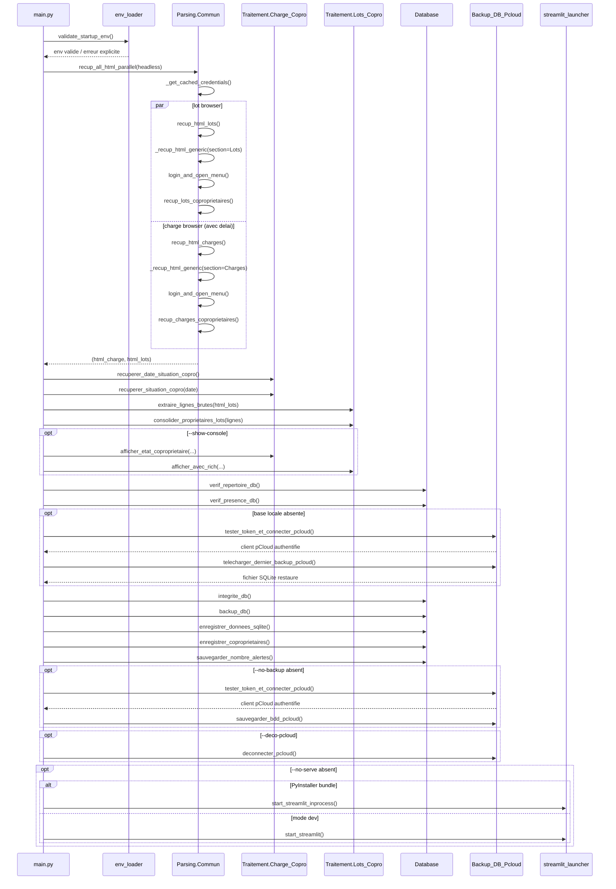
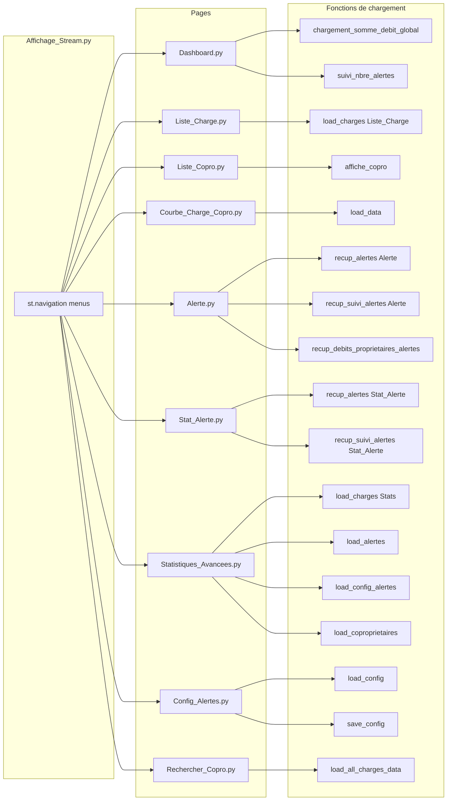

# Graphe des appels de fonctions - CPTCOPRO

## Objectif

Ce document decrit les appels de fonctions reels du projet et sert de reference de maintenance.
Il est aligne sur le code actuel de l'application.
Il privilegie la lisibilite: un resume rapide, un deroule pas-a-pas, puis des diagrammes de soutien.
Pour une vue plus compacte du depot, voir README.md et .github/copilot-instructions.md.

## Comment lire ce document

1. Le bloc "Vue d'ensemble" donne la carte rapide des modules appeles pendant un lancement normal.
2. Le bloc "Flux d'execution reel" detaille l'ordre concret des appels dans `main.py`.
3. Les tableaux de fin servent de reference courte pour les options CLI et les points d'entree a surveiller.

## Vue d'ensemble (runtime)

```mermaid
flowchart TB
    subgraph ENV[Bootstrap environnement]
        env_start[validate_startup_env]
    end

    subgraph ENTRY[Point d'entree]
        main["main.py main()"]
    end

    subgraph PARSING[Parsing]
        p_all[recup_all_html_parallel]
        p_get[_get_cached_credentials]
        p_hc[recup_html_charges]
        p_hl[recup_html_lots]
        p_gen[_recup_html_generic]
        p_login[login_and_open_menu]
        p_c[recup_charges_coproprietaires]
        p_l[recup_lots_coproprietaires]
    end

    subgraph TRAITEMENT[Traitement]
        t_date[recuperer_date_situation_copro]
        t_sit[recuperer_situation_copro]
        t_lines[extraire_lignes_brutes]
        t_cons[consolider_proprietaires_lots]
        t_show1[afficher_etat_coproprietaire]
        t_show2[afficher_avec_rich]
    end

    subgraph DB[Database]
        d_rep[verif_repertoire_db]
        d_pre[verif_presence_db]
        d_int[integrite_db]
        d_bak[backup_db]
        d_restore[telecharger_dernier_backup_pcloud]
        d_up_pcloud[sauvegarder_bdd_pcloud]
        d_token[tester_token_et_connecter_pcloud]
        d_deco[deconnecter_pcloud]
        d_ins1[enregistrer_donnees_sqlite]
        d_ins2[enregistrer_coproprietaires]
        d_suivi[sauvegarder_nombre_alertes]
    end

    subgraph UI[Streamlit]
        ui_start[start_streamlit_inprocess / start_streamlit]
        ui_app[Affichage_Stream.py]
    end

    env_start --> main

    main --> p_all
    p_all --> p_get
    p_all --> p_hc
    p_all --> p_hl
    p_hc --> p_gen
    p_hl --> p_gen
    p_gen --> p_login
    p_gen --> p_c
    p_gen --> p_l

    main --> t_date
    main --> t_sit
    main --> t_lines
    main --> t_cons

    main -. show-console .-> t_show1
    main -. show-console .-> t_show2

    main --> d_rep
    main --> d_pre
    main --> d_int
    main --> d_bak
    main --> d_restore
    main --> d_up_pcloud
    main --> d_token
    main --> d_deco
    main --> d_ins1
    main --> d_ins2
    main --> d_suivi

    main -. no-serve=false .-> ui_start
    ui_start --> ui_app
```

## Deroule du flux principal

1. `validate_startup_env()` verifie les variables d'environnement avant tout autre traitement.
2. `recup_all_html_parallel()` lance la recuperation parallele du HTML des charges et des lots.
3. Le HTML des charges est parse pour extraire la date de situation, puis les lignes de charges.
4. Le HTML des lots est parse pour reconstruire la liste consolidee des coproprietaires.
5. Si `--show-console` est active, les donnees sont affichees dans la console avant toute ecriture.
6. La base locale est preparee avec `verif_repertoire_db()`, `verif_presence_db()` et `integrite_db()`.
7. Si la base locale manque, le programme tente une restauration pCloud avant de continuer.
8. La base locale est ensuite mise a jour: backup local, ecriture des coproprietaires, ecriture des charges, recalcul des alertes.
9. Si `--no-backup` n'est pas specifie, la base finale est sauvegardee sur pCloud.
10. Si `--deco-pcloud` est actif, le token local est supprime en fin d'execution.
11. Si `--no-serve` n'est pas specifie, Streamlit est lance apres la fin du traitement.

## Cas pCloud

| Situation | Action effectuee | Effet visible |
| --- | --- | --- |
| Base locale absente au demarrage | Connexion pCloud, puis telechargement du dernier backup | La base locale est restauree avant toute ecriture |
| Execution normale, sans `--no-backup` | Connexion pCloud, puis `sauvegarder_bdd_pcloud()` apres les ecritures | Le dernier etat valide est archive sur pCloud |
| Execution avec `--no-backup` | Aucun upload pCloud apres les ecritures | Seul le backup local reste actif |
| Execution avec `--deco-pcloud` | `deconnecter_pcloud()` puis suppression du token local | La session pCloud est ferme et le token local disparait |

## Flux d'execution reel (main)

```mermaid
sequenceDiagram
    participant M as main.py
    participant E as env_loader
    participant P as Parsing.Commun
    participant TC as Traitement.Charge_Copro
    participant TL as Traitement.Lots_Copro
    participant DB as Database
    participant PC as Backup_DB_Pcloud
    participant SL as streamlit_launcher

    M->>E: validate_startup_env()
    E-->>M: env valide / erreur explicite

    M->>P: recup_all_html_parallel(headless)
    P->>P: _get_cached_credentials()

    par lot browser
        P->>P: recup_html_lots()
        P->>P: _recup_html_generic(section=Lots)
        P->>P: login_and_open_menu()
        P->>P: recup_lots_coproprietaires()
    and charge browser (avec delai)
        P->>P: recup_html_charges()
        P->>P: _recup_html_generic(section=Charges)
        P->>P: login_and_open_menu()
        P->>P: recup_charges_coproprietaires()
    end

    P-->>M: (html_charge, html_lots)

    M->>TC: recuperer_date_situation_copro()
    M->>TC: recuperer_situation_copro(date)
    M->>TL: extraire_lignes_brutes(html_lots)
    M->>TL: consolider_proprietaires_lots(lignes)

    opt --show-console
        M->>TC: afficher_etat_coproprietaire(...)
        M->>TL: afficher_avec_rich(...)
    end

    M->>DB: verif_repertoire_db()
    M->>DB: verif_presence_db()
    opt base locale absente
        M->>PC: tester_token_et_connecter_pcloud()
        PC-->>M: client pCloud authentifie
        M->>PC: telecharger_dernier_backup_pcloud()
        PC-->>M: fichier SQLite restaure
    end
    M->>DB: integrite_db()
    M->>DB: backup_db()
    M->>DB: enregistrer_donnees_sqlite()
    M->>DB: enregistrer_coproprietaires()
    M->>DB: sauvegarder_nombre_alertes()

    opt --no-backup absent
        M->>PC: tester_token_et_connecter_pcloud()
        PC-->>M: client pCloud authentifie
        M->>PC: sauvegarder_bdd_pcloud()
    end

    opt --deco-pcloud
        M->>PC: deconnecter_pcloud()
    end

    opt --no-serve absent
        alt PyInstaller bundle
            M->>SL: start_streamlit_inprocess()
        else mode dev
            M->>SL: start_streamlit()
        end
    end
```

## Cartographie Streamlit complete

```mermaid
flowchart LR
    subgraph APP[Affichage_Stream.py]
        nav[st.navigation menus]
    end

    subgraph PAGES[Pages]
        pg_dashboard[Dashboard.py]
        pg_liste_charge[Liste_Charge.py]
        pg_liste_copro[Liste_Copro.py]
        pg_courbe[Courbe_Charge_Copro.py]
        pg_alerte[Alerte.py]
        pg_stat_alerte[Stat_Alerte.py]
        pg_stats_adv[Statistiques_Avancees.py]
        pg_config[Config_Alertes.py]
        pg_search[Rechercher_Copro.py]
    end

    subgraph DATA_FUNCTIONS[Fonctions de chargement]
        f_dash1[chargement_somme_debit_global]
        f_dash2[suivi_nbre_alertes]
        f_lc[load_charges Liste_Charge]
        f_lcopro[affiche_copro]
        f_courbe[load_data]
        f_al1[recup_alertes Alerte]
        f_al2[recup_suivi_alertes Alerte]
        f_al3[recup_debits_proprietaires_alertes]
        f_sa1[recup_alertes Stat_Alerte]
        f_sa2[recup_suivi_alertes Stat_Alerte]
        f_sadv1[load_charges Stats]
        f_sadv2[load_alertes]
        f_sadv3[load_config_alertes]
        f_sadv4[load_coproprietaires]
        f_cfg1[load_config]
        f_cfg2[save_config]
        f_rech[load_all_charges_data]
    end

    nav --> pg_dashboard --> f_dash1
    pg_dashboard --> f_dash2

    nav --> pg_liste_charge --> f_lc
    nav --> pg_liste_copro --> f_lcopro
    nav --> pg_courbe --> f_courbe

    nav --> pg_alerte --> f_al1
    pg_alerte --> f_al2
    pg_alerte --> f_al3

    nav --> pg_stat_alerte --> f_sa1
    pg_stat_alerte --> f_sa2

    nav --> pg_stats_adv --> f_sadv1
    pg_stats_adv --> f_sadv2
    pg_stats_adv --> f_sadv3
    pg_stats_adv --> f_sadv4

    nav --> pg_config --> f_cfg1
    pg_config --> f_cfg2

    nav --> pg_search --> f_rech
```

## Organisation des modules (corrigee)

| Module | Responsabilite | Fonctions principales |
| --- | --- | --- |
| main.py | Orchestration CLI de bout en bout | Recupere le HTML, parse les donnees, gere la base locale, lance les backups, puis ouvre Streamlit si demande |
| utils/env_loader.py | Chargement et validation des secrets | Verifie `.env`, charge les credentials COPRO et pCloud, bloque le demarrage si une variable manque |
| Parsing/Commun.py | Orchestration de la collecte HTML | Coordonne les deux navigateurs, gere le login, applique les delais et remonte les codes KO_* |
| Parsing/Charge_Copro.py | Navigation cote charges | Ouvre la bonne page et recupere le HTML des charges |
| Parsing/Lots_Copro.py | Navigation cote lots | Ouvre la bonne page et recupere le HTML des lots |
| Traitement/Charge_Copro.py | Extraction des charges | Lit la date de situation, reconstruit les lignes de charges, affiche l'etat copro si demande |
| Traitement/Lots_Copro.py | Extraction des lots | Lit les lignes brutes puis consolide les coproprietaires et lots |
| Database/Verif_Prerequis_BDD.py | Pre-requis repertoires | Verifie que les repertoires d'ecriture existent ou peuvent etre crees |
| Database/Creation_BDD.py | Sante de la base | Verifie la presence de la base et l'integrite minimale du schema |
| Database/Charges_To_BDD.py | Ecriture des charges | Insere ou remplace les charges dans SQLite |
| Database/Coproprietaires_To_BDD.py | Ecriture des coproprietaires | Insere les coproprietaires avant les charges pour satisfaire les triggers |
| Database/Alertes_Config.py | Alertes et seuils | Gere les seuils, le suivi des alertes et le recalcul du nombre d'alertes |
| Database/Backup_DB.py | Backup local SQLite | Copie la base locale dans le repertoire de backup du projet |
| Database/Backup_DB_Pcloud.py | Backup et restauration pCloud | Gere le token, la connexion, la restauration, l'upload et la deconnexion |
| Database/Dedoublonnage.py | Outils hors flux principal | Conserve des aides historiques de dedoublonnage, non appellees par `main.py` |
| Affichage_Stream.py | Interface Streamlit | Construit la navigation multi-pages et lance les pages |

## Constantes de timing (source de verite)

| Constante | Valeur | Unite | Usage |
| --- | ---: | --- | --- |
| DELAY_PARALLEL_LOGIN | 3.0 | secondes | Decalage avant login charges en mode parallele |
| DELAY_RETRY_URL | 2000 | millisecondes | Attente avant retry acces URL |
| DELAY_RETRY_MENU | 3000 | millisecondes | Attente avant retry clic menu |
| TIMEOUT_URL_ACCESS | 30000 | millisecondes | Timeout navigation URL |
| TIMEOUT_MENU_WAIT | 15000 | millisecondes | Timeout attente menu |

## Options CLI qui changent le flux

| Option | Effet sur le flux |
| --- | --- |
| --show-console | Active les affichages Rich apres parsing, avant les ecritures |
| --no-serve | Arrete le flux avant le lancement de Streamlit |
| --no-headless | Lance Playwright en mode visible pour le debug |
| --no-backup | Saute l'upload pCloud final, mais garde le backup local |
| --deco-pcloud | Ferme la session pCloud et supprime le token local |
| --db-path | Oriente toutes les lectures et ecritures vers une autre base SQLite |
| --serve-host, --serve-port | Modifient l'adresse de lancement de Streamlit |
| --streamlit-* | Reglent l'ouverture du navigateur, de la console et du log |

## Notes importantes

- `_recup_html_generic` reste le coeur DRY de la collecte HTML.
- `validate_startup_env()` est le point d'entree unique pour verifier les variables requises au demarrage.
- Le flux principal de `main.py` repose sur `validate_startup_env()`, pas sur un autre bootstrap.
- Le flux principal n'appelle plus le dedoublonnage.
- Raison: index UNIQUE et INSERT OR REPLACE dans la persistance des charges.
- Le backup local est fait avant les ecritures, alors que le backup pCloud est fait apres les ecritures, sauf `--no-backup`.
- `--deco-pcloud` se limite a la deconnexion pCloud et a la suppression du token local.
- Les pages Streamlit utilisent majoritairement `@st.cache_data` sur les fonctions de chargement.
- `README.md` donne la vue d'ensemble du projet; ce document decrit le detail des flux d'appel.

## Source of truth

Verifier en priorite ces fichiers lors des evolutions:

1. src/cptcopro/main.py
2. src/cptcopro/utils/env_loader.py
3. src/cptcopro/Parsing/Commun.py
4. src/cptcopro/Parsing/constants.py
5. src/cptcopro/Affichage_Stream.py
6. src/cptcopro/Database/__init__.py
7. src/cptcopro/Pages/*.py

## Checklist avant merge

1. Toutes les fonctions citees existent-elles encore avec le meme nom?
2. Les timings documentes correspondent-ils a Parsing/constants.py?
3. Les options CLI documentees existent-elles dans main.py?
4. Une nouvelle page Streamlit a-t-elle ete ajoutee dans Affichage_Stream.py?
5. Un flux conditionnel est-il devenu obligatoire (ou inversement)?
6. Les diagrammes Mermaid se rendent-ils correctement?
