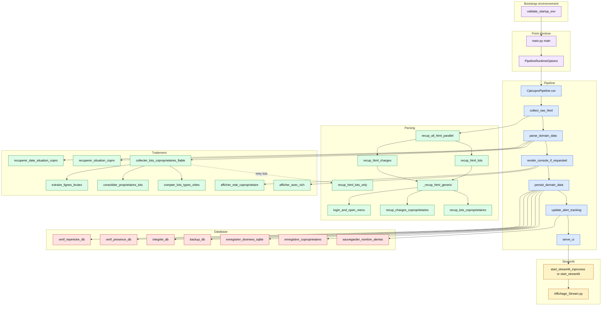
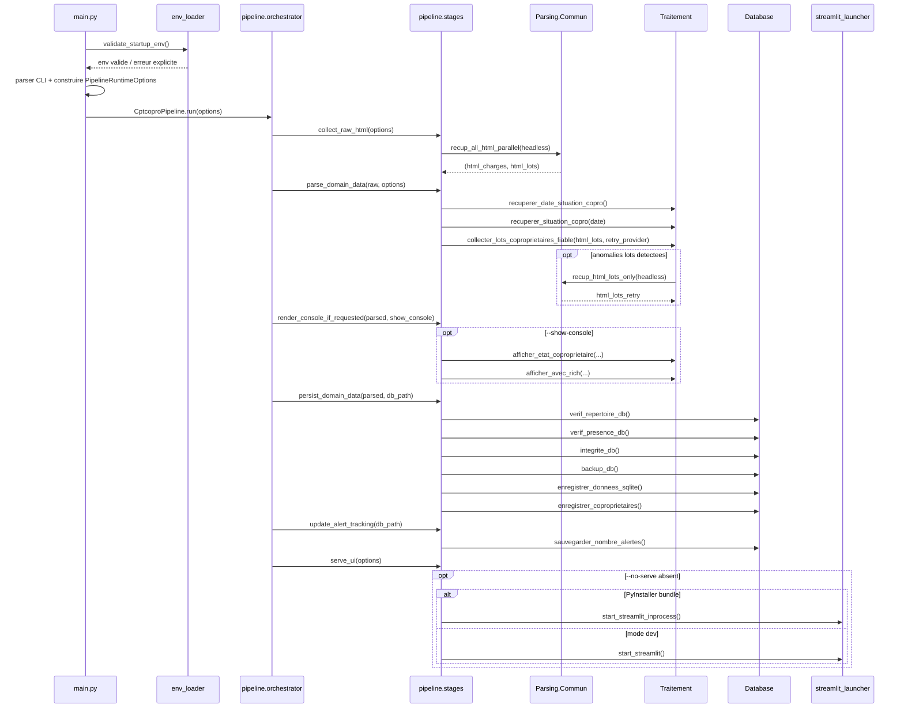
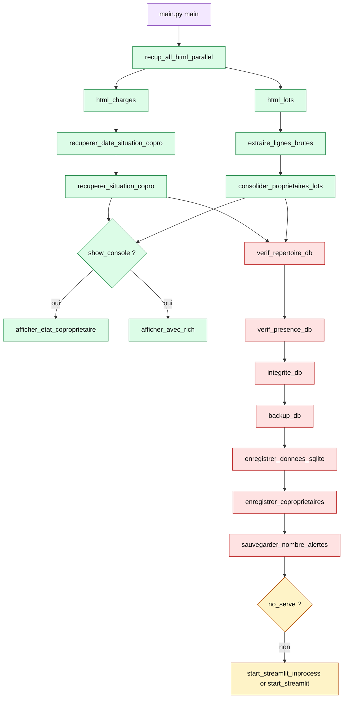
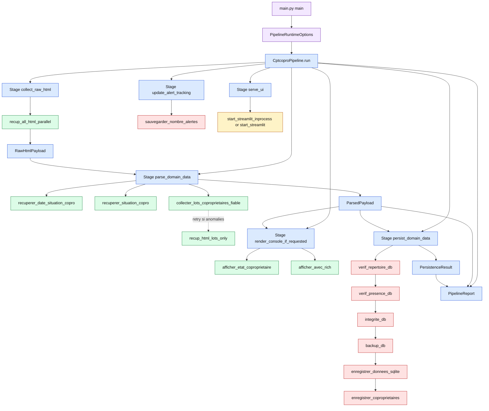
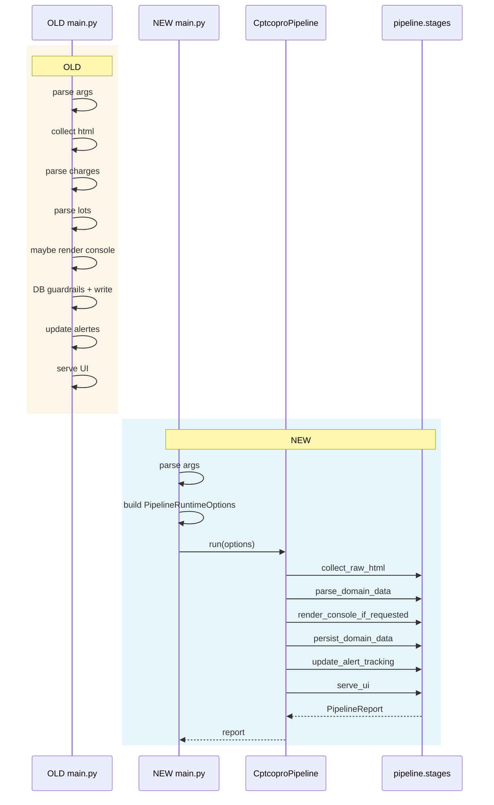
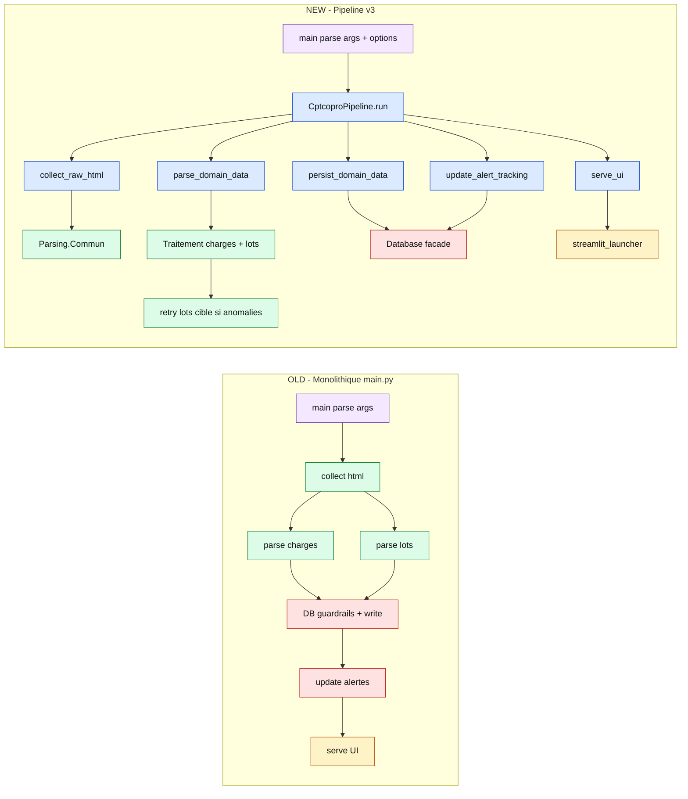
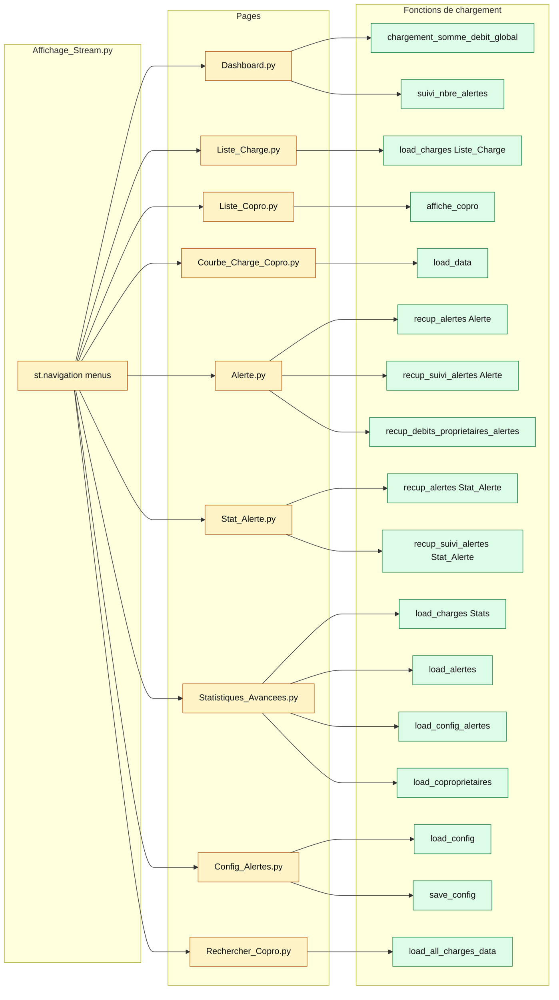

# Graphe des appels de fonctions - CPTCOPRO

## Objectif

Ce document decrit les appels de fonctions reels du projet et sert de reference de maintenance.
Il est aligne sur la structure pipeline v3 introduite dans `src/cptcopro/pipeline/`.
Pour une vue plus compacte du depot, voir README.md et .github/copilot-instructions.md.

## Conventions visuelles communes

Les diagrammes utilisent la meme palette par couche pour faciliter la lecture transversale.

1. Violet: Entry (point d'entree, parsing CLI, construction des options runtime).
2. Bleu: Pipeline (orchestration et stages applicatifs).
3. Vert: Parsing/Traitement (collecte HTML, parsing metier, consolidation lots).
4. Rouge: Database (guardrails, persistance, suivi alertes).
5. Jaune: UI (lancement et execution Streamlit).

## Vue d'ensemble (runtime v3)

```mermaid
flowchart TB
    classDef entry fill:#f3e8ff,stroke:#6b21a8,color:#111,stroke-width:1px;
    classDef pipeline fill:#dbeafe,stroke:#1d4ed8,color:#111,stroke-width:1px;
    classDef parsing fill:#dcfce7,stroke:#15803d,color:#111,stroke-width:1px;
    classDef db fill:#fee2e2,stroke:#b91c1c,color:#111,stroke-width:1px;
    classDef ui fill:#fef3c7,stroke:#b45309,color:#111,stroke-width:1px;

    subgraph ENV[Bootstrap environnement]
        env_start[validate_startup_env]
    end

    subgraph ENTRY[Point d'entree]
        main[main.py main]
        opts[PipelineRuntimeOptions]
    end

    subgraph PIPE[Pipeline]
        orch[CptcoproPipeline.run]
        s1[collect_raw_html]
        s2[parse_domain_data]
        s3[render_console_if_requested]
        s4[persist_domain_data]
        s5[update_alert_tracking]
        s6[serve_ui]
    end

    subgraph PARSING[Parsing]
        p_all[recup_all_html_parallel]
        p_lots_only[recup_html_lots_only]
        p_hc[recup_html_charges]
        p_hl[recup_html_lots]
        p_gen[_recup_html_generic]
        p_login[login_and_open_menu]
        p_c[recup_charges_coproprietaires]
        p_l[recup_lots_coproprietaires]
    end

    subgraph TRAITEMENT[Traitement]
        t_date[recuperer_date_situation_copro]
        t_sit[recuperer_situation_copro]
        t_collect_lots[collecter_lots_coproprietaires_fiable]
        t_lines[extraire_lignes_brutes]
        t_cons[consolider_proprietaires_lots]
        t_qc[compter_lots_types_vides]
        t_show1[afficher_etat_coproprietaire]
        t_show2[afficher_avec_rich]
    end

    subgraph DB[Database]
        d_rep[verif_repertoire_db]
        d_pre[verif_presence_db]
        d_int[integrite_db]
        d_bak[backup_db]
        d_ins1[enregistrer_donnees_sqlite]
        d_ins2[enregistrer_coproprietaires]
        d_suivi[sauvegarder_nombre_alertes]
    end

    subgraph UI[Streamlit]
        ui_start[start_streamlit_inprocess or start_streamlit]
        ui_app[Affichage_Stream.py]
    end

    env_start --> main --> opts --> orch
    orch --> s1 --> s2 --> s3 --> s4 --> s5 --> s6

    s1 --> p_all
    p_all --> p_hc
    p_all --> p_hl
    p_hc --> p_gen
    p_hl --> p_gen
    p_gen --> p_login
    p_gen --> p_c
    p_gen --> p_l

    s2 --> t_date
    s2 --> t_sit
    s2 --> t_collect_lots
    t_collect_lots --> t_lines
    t_collect_lots --> t_cons
    t_collect_lots --> t_qc
    t_collect_lots -. retry lots .-> p_lots_only

    s3 --> t_show1
    s3 --> t_show2

    s4 --> d_rep
    s4 --> d_pre
    s4 --> d_int
    s4 --> d_bak
    s4 --> d_ins1
    s4 --> d_ins2
    s5 --> d_suivi

    s6 --> ui_start --> ui_app

    class env_start,main,opts entry;
    class orch,s1,s2,s3,s4,s5,s6 pipeline;
    class p_all,p_lots_only,p_hc,p_hl,p_gen,p_login,p_c,p_l,t_date,t_sit,t_collect_lots,t_lines,t_cons,t_qc,t_show1,t_show2 parsing;
    class d_rep,d_pre,d_int,d_bak,d_ins1,d_ins2,d_suivi db;
    class ui_start,ui_app ui;
```

## Flux d'execution reel (main -> pipeline)

```mermaid
sequenceDiagram
    participant M as main.py
    participant E as env_loader
    participant O as pipeline.orchestrator
    participant S as pipeline.stages
    participant P as Parsing.Commun
    participant T as Traitement
    participant DB as Database
    participant SL as streamlit_launcher

    M->>E: validate_startup_env()
    E-->>M: env valide / erreur explicite
    M->>M: parser CLI + construire PipelineRuntimeOptions
    M->>O: CptcoproPipeline.run(options)

    O->>S: collect_raw_html(options)
    S->>P: recup_all_html_parallel(headless)
    P-->>S: (html_charges, html_lots)

    O->>S: parse_domain_data(raw, options)
    S->>T: recuperer_date_situation_copro()
    S->>T: recuperer_situation_copro(date)
    S->>T: collecter_lots_coproprietaires_fiable(html_lots, retry_provider)
    opt anomalies lots detectees
        T->>P: recup_html_lots_only(headless)
        P-->>T: html_lots_retry
    end

    O->>S: render_console_if_requested(parsed, show_console)
    opt --show-console
        S->>T: afficher_etat_coproprietaire(...)
        S->>T: afficher_avec_rich(...)
    end

    O->>S: persist_domain_data(parsed, db_path)
    S->>DB: verif_repertoire_db()
    S->>DB: verif_presence_db()
    S->>DB: integrite_db()
    S->>DB: backup_db()
    S->>DB: enregistrer_donnees_sqlite()
    S->>DB: enregistrer_coproprietaires()

    O->>S: update_alert_tracking(db_path)
    S->>DB: sauvegarder_nombre_alertes()

    O->>S: serve_ui(options)
    opt --no-serve absent
        alt PyInstaller bundle
            S->>SL: start_streamlit_inprocess()
        else mode dev
            S->>SL: start_streamlit()
        end
    end
```

## Schema Old vs New (detaille et explicite)

### Old (avant pipeline v3)

Le point d'entree `main.py` executait directement la plupart des appels metier, de collecte et de persistance.

```mermaid
flowchart TB
    classDef entry fill:#f3e8ff,stroke:#6b21a8,color:#111,stroke-width:1px;
    classDef parsing fill:#dcfce7,stroke:#15803d,color:#111,stroke-width:1px;
    classDef db fill:#fee2e2,stroke:#b91c1c,color:#111,stroke-width:1px;
    classDef ui fill:#fef3c7,stroke:#b45309,color:#111,stroke-width:1px;

    A[main.py main] --> B[recup_all_html_parallel]
    B --> C[html_charges]
    B --> D[html_lots]

    C --> E[recuperer_date_situation_copro]
    E --> F[recuperer_situation_copro]

    D --> G[extraire_lignes_brutes]
    G --> H[consolider_proprietaires_lots]

    F --> I{show_console ?}
    H --> I
    I -->|oui| J[afficher_etat_coproprietaire]
    I -->|oui| K[afficher_avec_rich]

    F --> L[verif_repertoire_db]
    H --> L
    L --> M[verif_presence_db]
    M --> N[integrite_db]
    N --> O[backup_db]
    O --> P[enregistrer_donnees_sqlite]
    P --> Q[enregistrer_coproprietaires]
    Q --> R[sauvegarder_nombre_alertes]

    R --> S{no_serve ?}
    S -->|non| T[start_streamlit_inprocess or start_streamlit]

    class A entry;
    class B,C,D,E,F,G,H,I,J,K parsing;
    class L,M,N,O,P,Q,R db;
    class S,T ui;
```

### New (pipeline v3)

Le point d'entree `main.py` construit les options et delegue a l'orchestrateur, qui appelle des stages nommes et testables.

```mermaid
flowchart TB
    classDef entry fill:#f3e8ff,stroke:#6b21a8,color:#111,stroke-width:1px;
    classDef pipeline fill:#dbeafe,stroke:#1d4ed8,color:#111,stroke-width:1px;
    classDef parsing fill:#dcfce7,stroke:#15803d,color:#111,stroke-width:1px;
    classDef db fill:#fee2e2,stroke:#b91c1c,color:#111,stroke-width:1px;
    classDef ui fill:#fef3c7,stroke:#b45309,color:#111,stroke-width:1px;

    A[main.py main] --> B[PipelineRuntimeOptions]
    B --> C[CptcoproPipeline.run]

    C --> D[Stage collect_raw_html]
    D --> E[recup_all_html_parallel]
    E --> F[RawHtmlPayload]

    C --> G[Stage parse_domain_data]
    F --> G
    G --> H[recuperer_date_situation_copro]
    G --> I[recuperer_situation_copro]
    G --> J[collecter_lots_coproprietaires_fiable]
    J -. retry si anomalies .-> K[recup_html_lots_only]
    G --> L[ParsedPayload]

    C --> M[Stage render_console_if_requested]
    L --> M
    M --> N[afficher_etat_coproprietaire]
    M --> O[afficher_avec_rich]

    C --> P[Stage persist_domain_data]
    L --> P
    P --> P1[verif_repertoire_db]
    P1 --> P2[verif_presence_db]
    P2 --> P3[integrite_db]
    P3 --> P4[backup_db]
    P4 --> P5[enregistrer_donnees_sqlite]
    P5 --> P6[enregistrer_coproprietaires]
    P --> Q[PersistenceResult]

    C --> R[Stage update_alert_tracking]
    R --> R1[sauvegarder_nombre_alertes]

    C --> S[Stage serve_ui]
    S --> T[start_streamlit_inprocess or start_streamlit]

    C --> U[PipelineReport]
    L --> U
    Q --> U

    class A,B entry;
    class C,D,G,M,P,R,S pipeline;
    class E,H,I,J,K,N,O parsing;
    class F,L,Q,U pipeline;
    class P1,P2,P3,P4,P5,P6,R1 db;
    class T ui;
```

### Mapping old -> new (fonction par fonction)

| Zone fonctionnelle | Old (execution directe) | New (stage pipeline) | Benefice principal |
| --- | --- | --- | --- |
| Bootstrap env | validate_startup_env dans main | identique dans main | comportement preserve |
| Construction contexte runtime | variables locales eparses dans main | PipelineRuntimeOptions | contrat explicite et serialisable |
| Collecte HTML | appel direct recup_all_html_parallel | collect_raw_html | etape nommee + erreur HtmlCollectionError |
| Parsing charges | appels directs recuperer_date_situation_copro + recuperer_situation_copro | parse_domain_data | responsabilite centralisee parsing |
| Parsing lots | extraire_lignes_brutes + consolider_proprietaires_lots dans le flux principal | collecter_lots_coproprietaires_fiable depuis parse_domain_data | quality gate lots encapsule |
| Retry lots | absent ou logique ad hoc dans entrypoint | retry via recup_html_lots_only dans collecter_lots_coproprietaires_fiable | robustesse stable et reutilisable |
| Affichage console | if show_console dans main | render_console_if_requested | separation I/O presentation |
| Guardrails DB | sequence directe dans main | persist_domain_data | etape atomique testable |
| Ecriture charges/copro | appels directs DB | persist_domain_data | gestion d'erreur uniformisee |
| Mise a jour alertes | try/except dans main | update_alert_tracking | stage best-effort dedie |
| Lancement UI | bloc conditionnel long dans main | serve_ui | main raccourci et lisible |
| Resume de run | logs disperses | PipelineReport | sortie standard de pipeline |

### Delta de responsabilites

| Sujet | Old | New |
| --- | --- | --- |
| Role de main.py | pilote detaille du workflow | bootstrap CLI + delegation orchestrateur |
| Couplage | fort entre entrypoint, parsing, DB, UI | couplage reduit via stages |
| Frontieres metier | implicites | explicites (collect, parse, persist, serve) |
| Contrats de donnees | listes/tuples/dicts circulant sans type central | dataclasses pipeline dediees |
| Trajectoire d'erreur | exceptions heterogenes selon modules | famille PipelineStageError avec stage cible |
| Retentatives | difficiles a localiser | encapsulees par zone metier |

### Delta de gestion d'erreurs

| Type d'echec | Old (typique) | New (v3) |
| --- | --- | --- |
| Echec collecte HTML | log + return ou RuntimeError selon contexte | HtmlCollectionError(stage=collect_html) |
| Date introuvable | arret local dans main | ParsingError(stage=parse_charges) |
| Incoherence lots/copro | exception BDD levee tardivement | detection plus tot + retry lots + validation BDD |
| Echec persistance | RuntimeError depuis main | PersistenceError(stage=persist) |
| Echec UI | bloc try/except dans main | ServingError(stage=serve_ui) |

### Delta testabilite et maintenabilite

| Critere | Old | New |
| --- | --- | --- |
| Test unitaire du sequencing global | difficile (main monolithique) | direct via tests orchestrateur |
| Mock des etapes | lourd | naturel (monkeypatch des stages) |
| Impact d'une evolution locale | souvent transversal | limite au stage concerne |
| Lisibilite du flux | lineaire mais long | lineaire, nomme, compact |

### Trajectoire d'une execution (comparatif)

```mermaid
sequenceDiagram
    participant OldMain as OLD main.py
    participant NewMain as NEW main.py
    participant Orch as CptcoproPipeline
    participant Stages as pipeline.stages

    rect rgb(250,245,230)
    Note over OldMain: OLD
    OldMain->>OldMain: parse args
    OldMain->>OldMain: collect html
    OldMain->>OldMain: parse charges
    OldMain->>OldMain: parse lots
    OldMain->>OldMain: maybe render console
    OldMain->>OldMain: DB guardrails + write
    OldMain->>OldMain: update alertes
    OldMain->>OldMain: serve UI
    end

    rect rgb(230,245,250)
    Note over NewMain,Stages: NEW
    NewMain->>NewMain: parse args
    NewMain->>NewMain: build PipelineRuntimeOptions
    NewMain->>Orch: run(options)
    Orch->>Stages: collect_raw_html
    Orch->>Stages: parse_domain_data
    Orch->>Stages: render_console_if_requested
    Orch->>Stages: persist_domain_data
    Orch->>Stages: update_alert_tracking
    Orch->>Stages: serve_ui
    Stages-->>Orch: PipelineReport
    Orch-->>NewMain: report
    end
```

### Resume architectural

1. Old: main concentrait orchestration, logique de flux et gestion d'erreurs.
2. New: main devient mince; orchestration dediee dans CptcoproPipeline.
3. Old: contrats de donnees implicites.
4. New: contrats explicites via dataclasses pipeline.
5. Old: erreurs heterogenes difficiles a classifier.
6. New: erreurs typées par stage avec contexte de panne.

### Vue visuelle split horizontal (Old vs New)

Lecture: meme palette des deux cotes pour comparer les couches equivalentes.

```mermaid
flowchart LR
    classDef entry fill:#f3e8ff,stroke:#6b21a8,color:#111,stroke-width:1px;
    classDef pipeline fill:#dbeafe,stroke:#1d4ed8,color:#111,stroke-width:1px;
    classDef parsing fill:#dcfce7,stroke:#15803d,color:#111,stroke-width:1px;
    classDef db fill:#fee2e2,stroke:#b91c1c,color:#111,stroke-width:1px;
    classDef ui fill:#fef3c7,stroke:#b45309,color:#111,stroke-width:1px;

    subgraph OLD[OLD - Monolithique main.py]
        o1[main parse args]:::entry --> o2[collect html]:::parsing
        o2 --> o3[parse charges]:::parsing
        o2 --> o4[parse lots]:::parsing
        o3 --> o5[DB guardrails + write]:::db
        o4 --> o5
        o5 --> o6[update alertes]:::db
        o6 --> o7[serve UI]:::ui
    end

    subgraph NEW[NEW - Pipeline v3]
        n1[main parse args + options]:::entry --> n2[CptcoproPipeline.run]:::pipeline
        n2 --> n3[collect_raw_html]:::pipeline
        n3 --> n4[Parsing.Commun]:::parsing
        n2 --> n5[parse_domain_data]:::pipeline
        n5 --> n6[Traitement charges + lots]:::parsing
        n6 --> n6b[retry lots cible si anomalies]:::parsing
        n2 --> n7[persist_domain_data]:::pipeline
        n7 --> n8[Database facade]:::db
        n2 --> n9[update_alert_tracking]:::pipeline
        n9 --> n8
        n2 --> n10[serve_ui]:::pipeline
        n10 --> n11[streamlit_launcher]:::ui
    end
```

La legende globale est definie dans la section "Conventions visuelles communes".

## Contrats pipeline (objets)

| Objet | Role | Defini dans |
| --- | --- | --- |
| PipelineRuntimeOptions | Options runtime derivees de la CLI | src/cptcopro/pipeline/models.py |
| RawHtmlPayload | HTML brut charges/lots | src/cptcopro/pipeline/models.py |
| ParsedPayload | Donnees metier parsees et metriques lots | src/cptcopro/pipeline/models.py |
| PersistenceResult | Resume des ecritures BDD | src/cptcopro/pipeline/models.py |
| PipelineReport | Resultat global du run | src/cptcopro/pipeline/models.py |

## Gestion des erreurs pipeline

| Erreur | Stage cible |
| --- | --- |
| PipelineStageError | Base commune avec nom du stage |
| HtmlCollectionError | collect_raw_html |
| ParsingError | parse_domain_data |
| PersistenceError | persist_domain_data |
| ServingError | serve_ui |

## Cartographie Streamlit complete

```mermaid
flowchart LR
    classDef ui fill:#fef3c7,stroke:#b45309,color:#111,stroke-width:1px;
    classDef parsing fill:#dcfce7,stroke:#15803d,color:#111,stroke-width:1px;

    subgraph APP[Affichage_Stream.py]
        nav[st.navigation menus]
    end

    subgraph PAGES[Pages]
        pg_dashboard[Dashboard.py]
        pg_liste_charge[Liste_Charge.py]
        pg_liste_copro[Liste_Copro.py]
        pg_courbe[Courbe_Charge_Copro.py]
        pg_alerte[Alerte.py]
        pg_stat_alerte[Stat_Alerte.py]
        pg_stats_adv[Statistiques_Avancees.py]
        pg_config[Config_Alertes.py]
        pg_search[Rechercher_Copro.py]
    end

    subgraph DATA_FUNCTIONS[Fonctions de chargement]
        f_dash1[chargement_somme_debit_global]
        f_dash2[suivi_nbre_alertes]
        f_lc[load_charges Liste_Charge]
        f_lcopro[affiche_copro]
        f_courbe[load_data]
        f_al1[recup_alertes Alerte]
        f_al2[recup_suivi_alertes Alerte]
        f_al3[recup_debits_proprietaires_alertes]
        f_sa1[recup_alertes Stat_Alerte]
        f_sa2[recup_suivi_alertes Stat_Alerte]
        f_sadv1[load_charges Stats]
        f_sadv2[load_alertes]
        f_sadv3[load_config_alertes]
        f_sadv4[load_coproprietaires]
        f_cfg1[load_config]
        f_cfg2[save_config]
        f_rech[load_all_charges_data]
    end

    nav --> pg_dashboard --> f_dash1
    pg_dashboard --> f_dash2

    nav --> pg_liste_charge --> f_lc
    nav --> pg_liste_copro --> f_lcopro
    nav --> pg_courbe --> f_courbe

    nav --> pg_alerte --> f_al1
    pg_alerte --> f_al2
    pg_alerte --> f_al3

    nav --> pg_stat_alerte --> f_sa1
    pg_stat_alerte --> f_sa2

    nav --> pg_stats_adv --> f_sadv1
    pg_stats_adv --> f_sadv2
    pg_stats_adv --> f_sadv3
    pg_stats_adv --> f_sadv4

    nav --> pg_config --> f_cfg1
    pg_config --> f_cfg2

    nav --> pg_search --> f_rech

    class nav,pg_dashboard,pg_liste_charge,pg_liste_copro,pg_courbe,pg_alerte,pg_stat_alerte,pg_stats_adv,pg_config,pg_search ui;
    class f_dash1,f_dash2,f_lc,f_lcopro,f_courbe,f_al1,f_al2,f_al3,f_sa1,f_sa2,f_sadv1,f_sadv2,f_sadv3,f_sadv4,f_cfg1,f_cfg2,f_rech parsing;
```

## Organisation des modules (v3)

| Module | Responsabilite | Fonctions / classes principales |
| --- | --- | --- |
| src/cptcopro/main.py | Point d'entree CLI + bootstrap | main |
| src/cptcopro/pipeline/models.py | Contrats de donnees du pipeline | PipelineRuntimeOptions, RawHtmlPayload, ParsedPayload, PersistenceResult, PipelineReport |
| src/cptcopro/pipeline/errors.py | Erreurs typées par stage | PipelineStageError, HtmlCollectionError, ParsingError, PersistenceError, ServingError |
| src/cptcopro/pipeline/stages.py | Etapes executables du pipeline | collect_raw_html, parse_domain_data, render_console_if_requested, persist_domain_data, update_alert_tracking, serve_ui |
| src/cptcopro/pipeline/orchestrator.py | Orchestration des stages | CptcoproPipeline.run |
| src/cptcopro/Parsing/Commun.py | Collecte HTML parallele + retry lots | recup_all_html_parallel, recup_html_lots_only, recup_html_charges, recup_html_lots, _recup_html_generic, login_and_open_menu |
| src/cptcopro/Traitement/Charge_Copro.py | Parsing HTML charges | recuperer_date_situation_copro, recuperer_situation_copro, afficher_etat_coproprietaire |
| src/cptcopro/Traitement/Lots_Copro.py | Parsing + consolidation + quality gate lots | collecter_lots_coproprietaires_fiable, extraire_lignes_brutes, consolider_proprietaires_lots, compter_lots_types_vides, afficher_avec_rich |
| src/cptcopro/Database/__init__.py | Facade DB | verif_repertoire_db, verif_presence_db, integrite_db, backup_db, enregistrer_donnees_sqlite, enregistrer_coproprietaires, sauvegarder_nombre_alertes |
| src/cptcopro/Affichage_Stream.py | Navigation multi-pages Streamlit | st.navigation, menus.run |

## Constantes de timing (source de verite)

| Constante | Valeur | Unite | Usage |
| --- | ---: | --- | --- |
| DELAY_PARALLEL_LOGIN | 3.0 | secondes | Decalage avant login charges en mode parallele |
| DELAY_RETRY_URL | 2000 | millisecondes | Attente avant retry acces URL |
| DELAY_RETRY_MENU | 3000 | millisecondes | Attente avant retry clic menu |
| TIMEOUT_URL_ACCESS | 30000 | millisecondes | Timeout navigation URL |
| TIMEOUT_MENU_WAIT | 15000 | millisecondes | Timeout attente menu |

## Options CLI qui changent le flux

| Option | Effet sur le flux |
| --- | --- |
| --show-console | Active render_console_if_requested |
| --no-serve | Desactive serve_ui |
| --no-headless | Lance Playwright en mode visible |
| --db-path | Surcharge PipelineRuntimeOptions.db_path |
| --serve-host, --serve-port | Parametrent serve_ui |
| --streamlit-* | Controle ouverture navigateur/console et redirection log |

## Notes importantes

- `main.py` n'implemente plus la logique metier: il delegue a `CptcoproPipeline.run`.
- La strategie de robustesse lots (anomalies lot/type + retry cible) est dans `Traitement/Lots_Copro.py`.
- Le pipeline appelle les fonctions DB existantes; le dedoublonnage reste hors flux principal.
- Les pages Streamlit utilisent majoritairement `@st.cache_data` sur les fonctions de chargement.
- README.md donne la vue d'ensemble du projet; ce document decrit le detail des flux d'appel.

## Source of truth

Verifier en priorite ces fichiers lors des evolutions:

1. src/cptcopro/main.py
2. src/cptcopro/pipeline/orchestrator.py
3. src/cptcopro/pipeline/stages.py
4. src/cptcopro/pipeline/models.py
5. src/cptcopro/pipeline/errors.py
6. src/cptcopro/Parsing/Commun.py
7. src/cptcopro/Traitement/Lots_Copro.py
8. src/cptcopro/Database/__init__.py
9. src/cptcopro/Affichage_Stream.py

## Checklist avant merge

1. Toutes les fonctions de `pipeline/stages.py` existent-elles encore avec le meme nom?
2. Les dataclasses de `pipeline/models.py` couvrent-elles tous les champs utilises?
3. Les exceptions de `pipeline/errors.py` sont-elles bien levees au bon stage?
4. Les timings documentes correspondent-ils a Parsing/constants.py?
5. Les options CLI documentees existent-elles dans `main.py`?
6. Une nouvelle page Streamlit a-t-elle ete ajoutee dans `Affichage_Stream.py`?
7. Les diagrammes Mermaid se rendent-ils correctement?
