# Graphe des appels de fonctions - CPTCOPRO

## Vue d'ensemble de l'architecture

```mermaid
flowchart TB
    subgraph MAIN["🚀 main.py"]
        main["main()"]
    end

    subgraph PARSING_COMMUN["🔗 Parsing_Commun.py"]
        recup_all_html_parallel["recup_all_html_parallel()"]
        recup_html_generic["_recup_html_generic()"]
        recup_html_charges["recup_html_charges()"]
        recup_html_lots["recup_html_lots()"]
        login_and_open_menu["login_and_open_menu()"]
        get_cached_credentials["_get_cached_credentials()"]
    end

    subgraph PARSING_CHARGE["📊 Parsing_Charge_Copro.py"]
        recup_charges_coproprietaires["recup_charges_coproprietaires()"]
    end

    subgraph PARSING_LOTS["🏠 Parsing_Lots_Copro.py"]
        recup_lots_coproprietaires["recup_lots_coproprietaires()"]
    end

    subgraph TRAITEMENT_CHARGE["⚙️ Traitement_Charge_Copro.py"]
        recuperer_date["recuperer_date_situation_copro()"]
        recuperer_situation["recuperer_situation_copro()"]
        afficher_etat["afficher_etat_coproprietaire()"]
    end

    subgraph TRAITEMENT_LOTS["⚙️ Traitement_Lots_Copro.py"]
        extraire_lignes["extraire_lignes_brutes()"]
        consolider["consolider_proprietaires_lots()"]
        afficher_rich["afficher_avec_rich()"]
    end

    subgraph DATA_BDD["💾 Data_To_BDD.py"]
        verif_repertoire["verif_repertoire_db()"]
        verif_presence["verif_presence_db()"]
        integrite_db["integrite_db()"]
        enregistrer_charges["enregistrer_donnees_sqlite()"]
        enregistrer_copro["enregistrer_coproprietaires()"]
        sauv_alertes["sauvegarder_nombre_alertes()"]
        get_config_alertes["get_config_alertes()"]
        update_config_alerte["update_config_alerte()"]
        get_threshold["get_threshold_for_type()"]
        init_config["init_config_alerte_if_missing()"]
    end

    subgraph STREAMLIT["📊 Pages Streamlit"]
        alerte_page["Alerte.py"]
        config_alertes_page["Config_Alertes.py"]
        courbe_charge_page["Courbe_Charge_Copro.py"]
        recup_alertes["recup_alertes()"]
        recup_suivi["recup_suivi_alertes()"]
        recup_debits["recup_debits_proprietaires_alertes()"]
        load_data_courbe["load_data()"]
    end

    subgraph BACKUP["💿 Backup_DB.py"]
        backup_db["backup_db()"]
    end

    subgraph DEDOUBLONNAGE["🔍 Dedoublonnage.py"]
        analyse_doublons["analyse_doublons()"]
        rapport_doublon["rapport_doublon()"]
        suppression_doublons["suppression_doublons()"]
    end

    subgraph UTILS["🛠️ Utils"]
        env_loader["get_credentials()"]
        browser_launcher["launch_browser()"]
        streamlit_launcher["start_streamlit()"]
    end

    %% Flux principal
    main --> recup_all_html_parallel
    
    %% Parsing parallèle
    recup_all_html_parallel --> get_cached_credentials
    recup_all_html_parallel --> recup_html_charges
    recup_all_html_parallel --> recup_html_lots
    
    %% Fonction générique (DRY)
    recup_html_charges --> recup_html_generic
    recup_html_lots --> recup_html_generic
    
    recup_html_generic --> browser_launcher
    recup_html_generic --> login_and_open_menu
    recup_html_generic -.->|"fetch_func"| recup_charges_coproprietaires
    recup_html_generic -.->|"fetch_func"| recup_lots_coproprietaires
    
    get_cached_credentials --> env_loader
    
    %% Traitement des données
    main --> recuperer_date
    main --> recuperer_situation
    main --> extraire_lignes
    main --> consolider
    main --> afficher_etat
    main --> afficher_rich
    
    %% Base de données (appels séquentiels simples)
    main --> verif_repertoire
    main --> verif_presence
    main --> integrite_db
    main --> backup_db
    main --> enregistrer_charges
    main --> enregistrer_copro
    
    %% Déduplication
    main --> analyse_doublons
    main --> rapport_doublon
    main --> suppression_doublons
    
    %% Alertes
    main --> sauv_alertes
    
    %% Configuration alertes
    integrite_db --> init_config
    verif_presence --> init_config
    config_alertes_page --> get_config_alertes
    config_alertes_page --> update_config_alerte
    
    %% Pages Streamlit
    alerte_page --> recup_alertes
    alerte_page --> recup_suivi
    alerte_page --> recup_debits
    courbe_charge_page --> load_data_courbe
    
    %% Streamlit
    main --> streamlit_launcher
```



## Flux d'exécution détaillé


## Structure des modules

| Module | Responsabilité | Fonctions principales |
|--------|----------------|----------------------|
| `main.py` | Orchestration principale, CLI | `main()` |
| `Parsing_Commun.py` | Connexion, authentification, orchestration parallèle | `recup_all_html_parallel()`, `_recup_html_generic()`, `login_and_open_menu()` |
| `Parsing_Charge_Copro.py` | Navigation spécifique pour les charges | `recup_charges_coproprietaires()` |
| `Parsing_Lots_Copro.py` | Navigation spécifique pour les lots | `recup_lots_coproprietaires()` |
| `Traitement_Charge_Copro.py` | Parsing HTML des charges | `recuperer_date_situation_copro()`, `recuperer_situation_copro()` |
| `Traitement_Lots_Copro.py` | Parsing HTML des lots | `extraire_lignes_brutes()`, `consolider_proprietaires_lots()` |
| `Data_To_BDD.py` | Opérations SQLite, configuration alertes | `enregistrer_donnees_sqlite()`, `enregistrer_coproprietaires()`, `integrite_db()`, `get_config_alertes()`, `update_config_alerte()`, `sauvegarder_nombre_alertes()` |
| `Backup_DB.py` | Sauvegarde de la base | `backup_db()` |
| `Dedoublonnage.py` | Détection/suppression doublons | `analyse_doublons()`, `suppression_doublons()`, `rapport_doublon()` |
| `Pages/Alerte.py` | Affichage des alertes Streamlit | `recup_alertes()`, `recup_suivi_alertes()`, `recup_debits_proprietaires_alertes()` |
| `Pages/Config_Alertes.py` | Configuration des seuils d'alerte | Interface Streamlit pour `get_config_alertes()`, `update_config_alerte()` |
| `Pages/Courbe_Charge_Copro.py` | Visualisation évolution des charges | `load_data()` — Top 10 calculé à la dernière date |

## Gestion des connexions SQLite

```mermaid
flowchart TB
    subgraph Architecture["✅ Architecture simple (try/finally)"]
        direction TB
        
        subgraph Func1["enregistrer_donnees_sqlite()"]
            conn1["conn = sqlite3.connect(db_path)"]
            try1["try: cursor.executemany(...)"]
            finally1["finally: conn.close()"]
            conn1 --> try1 --> finally1
        end
        
        subgraph Func2["enregistrer_coproprietaires()"]
            conn2["conn = sqlite3.connect(db_path)"]
            try2["try: cursor.executemany(...)"]
            finally2["finally: conn.close()"]
            conn2 --> try2 --> finally2
        end
        
        subgraph Func3["analyse_doublons()"]
            conn3["conn = sqlite3.connect(db_path)"]
            try3["try: cursor.execute(...)"]
            finally3["finally: conn.close()"]
            conn3 --> try3 --> finally3
        end
    end
```



### Pattern simple (sans context manager)

Chaque fonction gère sa propre connexion avec `try/finally` :

```python
def enregistrer_donnees_sqlite(data: list, db_path: str) -> None:
    """Enregistre les données des charges dans la base SQLite."""
    conn = sqlite3.connect(db_path)
    try:
        cursor = conn.cursor()
        cursor.executemany(
            "INSERT INTO charge (...) VALUES (...)",
            data[3:]
        )
        conn.commit()
        logger.success(f"{len(data[3:])} enregistrements insérés")
    finally:
        conn.close()
```

## Dépendances externes

```mermaid
flowchart LR
    subgraph Core["Modules principaux"]
        main
        PC["Parsing_Commun"]
        PCC["Parsing_Charge_Copro"]
        PLC["Parsing_Lots_Copro"]
        DB["Data_To_BDD"]
    end
    
    subgraph External["Dépendances externes"]
        playwright["🎭 Playwright"]
        selectolax["🔍 Selectolax"]
        sqlite["🗄️ SQLite"]
        rich["🎨 Rich"]
        streamlit["📊 Streamlit"]
        loguru["📝 Loguru"]
    end
    
    PC --> playwright
    PCC --> playwright
    PLC --> playwright
    DB --> sqlite
    main --> selectolax
    main --> sqlite
    main --> rich
    main --> streamlit
    main --> loguru
```



## Détail du flux parallèle

```mermaid
flowchart LR
    subgraph Orchestration["recup_all_html_parallel()"]
        direction TB
        start["Démarrage"] --> creds["_get_cached_credentials()"]
        creds --> parallel["asyncio.gather()"]
    end
    
    subgraph Nav1["Navigateur 1 (délai 0.8s)"]
        direction TB
        delay["await sleep(0.8)"] --> charges["recup_html_charges()"]
        charges --> generic1["_recup_html_generic(Charges)"]
        generic1 --> login1["login_and_open_menu()"]
        login1 --> nav1["fetch_func → recup_charges_coproprietaires()"]
        nav1 --> html1["HTML Charges"]
    end
    
    subgraph Nav2["Navigateur 2"]
        direction TB
        lots["recup_html_lots()"] --> generic2["_recup_html_generic(Lots)"]
        generic2 --> login2["login_and_open_menu()"]
        login2 --> nav2["fetch_func → recup_lots_coproprietaires()"]
        nav2 --> html2["HTML Lots"]
    end
    
    parallel --> Nav1
    parallel --> Nav2
    
    html1 --> result["Tuple (html_charges, html_lots)"]
    html2 --> result
```



## Refactorisation _recup_html_generic (DRY)

La fonction `_recup_html_generic` centralise la logique commune de browser/login/navigation :

```python
async def _recup_html_generic(
    headless: bool,
    login: str,
    password: str,
    url: str,
    section_name: str,  # "Charges" ou "Lots"
    fetch_func,         # Fonction de navigation spécifique
) -> str:
    """Fonction générique pour récupérer le HTML d'une section."""
    async with async_playwright() as p:
        browser = await launch_browser(p, headless=headless)
        if browser is None:
            return "KO_OPEN_BROWSER"
        
        page = await browser.new_page()
        error = await login_and_open_menu(page, login, password, url)
        if error:
            await browser.close()
            return error
        
        html = await fetch_func(page)  # Appel de la fonction spécifique
        await browser.close()
        return html
```

Les fonctions publiques deviennent de simples wrappers :

```python
async def recup_html_charges(...) -> str:
    return await _recup_html_generic(
        ..., section_name="Charges",
        fetch_func=pcc.recup_charges_coproprietaires
    )

async def recup_html_lots(...) -> str:
    return await _recup_html_generic(
        ..., section_name="Lots",
        fetch_func=pcl.recup_lots_coproprietaires
    )
```

## Avantages du parsing parallèle

| Aspect | Séquentiel (avant) | Parallèle (maintenant) |
|--------|-------------------|----------------------|
| **Navigateurs** | 1 (réutilisé) | 2 (indépendants) |
| **Sessions** | Partagée | Isolées |
| **Temps** | ~T1 + T2 | ~max(T1, T2) |
| **Risques** | Conflits de cookies | Aucun |
| **Délai entre logins** | N/A | 800ms (évite blocage serveur) |

## Notes techniques

- **Parsing parallèle** : 2 navigateurs Playwright indépendants avec délai de 800ms
- **Refactorisation DRY** : `_recup_html_generic()` centralise la logique browser/login/navigation
- **Timeouts explicites** : `wait_for_selector` avec timeout de 10s avant les clics critiques
- **Validation** : Vérification que 64 copropriétaires sont consolidés
- **SQLite** : Chaque fonction gère sa propre connexion (simple et robuste)
- **Codes d'erreur** : Les fonctions de parsing retournent des codes `KO_*` en cas d'échec (générés dynamiquement via `section_name`)

## Système d'alertes configurables


### Tables du système d'alertes

| Table | Colonnes | Description |
|-------|----------|-------------|
| `config_alerte` | `type_apt` (PK), `charge_moyenne`, `taux`, `threshold`, `last_update` | Seuils configurables par type d'appartement |
| `alertes_debit_eleve` | `alerte_id`, `id_origin`, `nom_proprietaire`, `code_proprietaire`, `debit`, `type_alerte`, `first_detection`, `last_detection`, `occurence` | Alertes actives avec type d'appartement |
| `suivi_alertes` | `date_releve` (PK), `nombre_alertes`, `total_debit`, `nb_2p`, `nb_3p`, `nb_4p`, `nb_5p`, `nb_na`, `debit_2p`, `debit_3p`, `debit_4p`, `debit_5p`, `debit_na` | Historique des alertes par type |

### Seuils par défaut

| Type | Charge moyenne | Taux | Seuil |
|------|---------------|------|-------|
| 2p | 1500€ | 1.33 | 2000€ |
| 3p | 1800€ | 1.33 | 2400€ |
| 4p | 2100€ | 1.33 | 2800€ |
| 5p | 2400€ | 1.33 | 3200€ |
| default | 1500€ | 1.33 | 2000€ |
